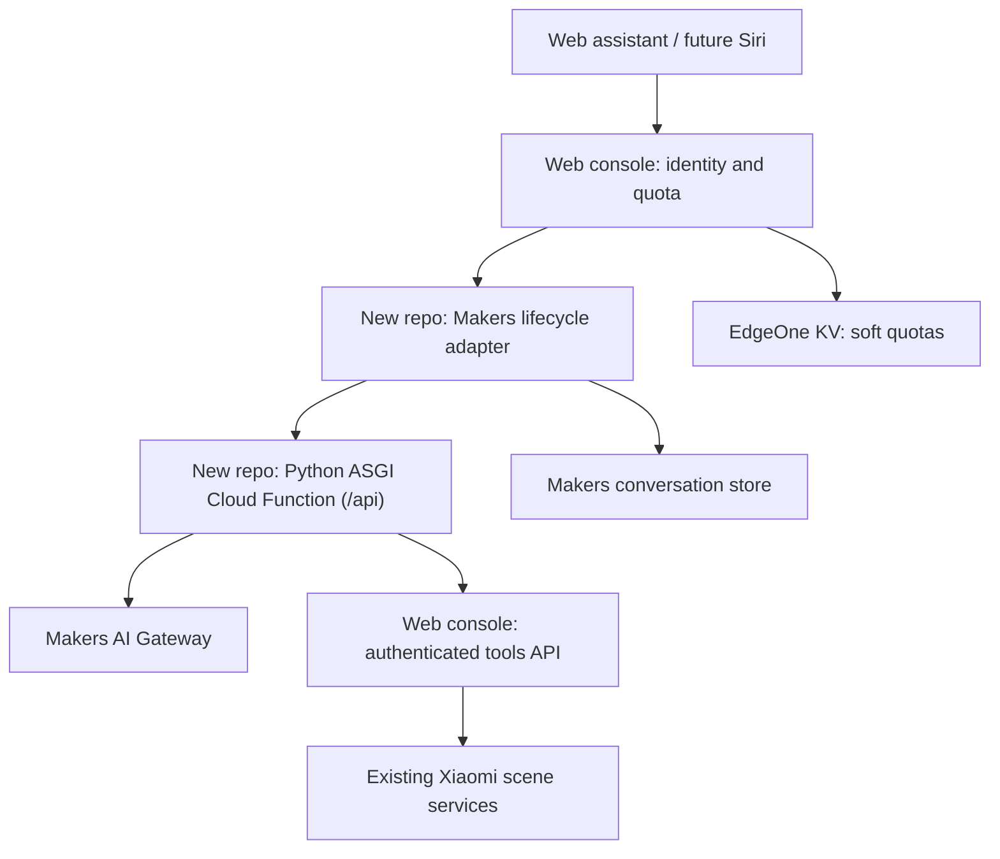

# Architecture

## Repository boundary

The physical-execution edge is the target design. The first companion patch permits
authorization and discovery only; activation returns `AI_SCENE_EXECUTION_DISABLED`.

| Responsibility | Owner after extraction | Reason |
|---|---|---|
| QR login, encrypted Xiaomi Cookie, raw Xiaomi user ID | Web console | Existing trusted credential boundary |
| Stable HMAC principal, home ownership, browser conversation handle | Web console | Never trust caller-supplied identity |
| Quota policy and reserve/commit/release | Web console Edge Functions | KV binding exists there; preserve one shared web/Siri ledger. Implementation is deferred (M3): remote mode runs with quota disabled and no ledger |
| Gateway provider, intent selection, safe tool validation | Python | Agent development belongs in the new repo |
| Conversation messages, lifecycle, platform cancellation | New repo Makers adapter | Preserve existing platform storage/runtime semantics |
| Python HTTP hosting | EdgeOne Cloud Functions (`cloud-functions/api`) | Deploy the ASGI boundary with the Makers project |
| Real scene IDs, risk review, enabled state, execution | Web console | Model and Python consume opaque aliases only |
| Reminder interpretation, preference policy | Future Python modules | Shared agent behavior across entrypoints |
| Durable reminder delivery, long-term preference storage | Future adapters | Not active conversation memory or quota KV |
| Web assistant UI | Web console | Existing authenticated application |

## Trusted context

The existing console derives `usr_` + Base64URL(HMAC-SHA256(secret, `xiaomi:` + userId)).
It validates current home access, issues scoped conversation handles, reserves quota,
and sends a short-lived sealed automation token to the Makers entrypoint. The token remains
opaque in both the adapter and Python. Only the console tools API can decrypt it.

Each adapter request authenticates the console using `AI_AGENT_INTERNAL_SECRET`,
then calls the console's `authorize` operation with `AI_TOOLS_INTERNAL_SECRET` and the
same automation token to validate current home membership before touching memory. Python
accepts only `AI_PYTHON_INTERNAL_SECRET`; it passes the token to the console, never the model.

These three secrets are server-only and independently rotated. Model requests contain
only user text, bounded history, locale/timezone, and sanitized scene summaries.
Model tool arguments may select an alias, never a principal, home or raw device address.

The Python endpoint does not independently enforce quotas. Its only permitted caller
is the adapter, whose only caller is the console. Quota implementation is deferred (M3):
while console `AI_QUOTA_ENABLED=false`, remote mode requires no adapter quota summary,
no internal quota route, and no ledger on either side — the console returns a fixed
principal-bound disabled summary, and neither service enforces limits or model-cost
protection. That mode is development-only. When quota is re-enabled, the adapter owns
settlement: it commits actual model usage after success, preserves usage reported by
finalized errors, and conservatively charges the original estimate when
Gateway/transport usage is unknown; clearly pre-flight errors release their reservation.
Protect both internal surfaces with service secrets and deployment ingress controls;
never expose their credentials to browsers or Siri. A future public Python ingress must
authenticate and reserve quota explicitly rather than reusing this internal endpoint.

Configured remote Agent origins must use HTTPS; plain HTTP is allowed only for local
development hosts. The web console preserves the stable status and code for disabled
execution, uncertain execution, store unavailability, and home authorization failures
rather than collapsing them into a generic agent failure.

The Makers project root is `adapters/edgeone`. That root co-locates the Agent marker
(`edgeone.json` and `agents/`) with the Cloud Functions marker (`cloud-functions/`).
Its Cloud Function entry
`cloud-functions/api/index.py` directly constructs `app = FastAPI(...)`—the entry marker
Tencent documents for ASGI routing—then registers the shared lifespan and routes. It
exposes the ASGI application at the external `/api` prefix; EdgeOne removes that prefix
before dispatch, so FastAPI continues to declare `/healthz` and the canonical
`/internal/v1/assistant` route. `/internal/v1/turn` remains legacy-only.
`src/mijia_agent` remains the canonical source and is copied into the Cloud Functions
build tree by `npm run build --prefix adapters/edgeone`. EdgeOne's generated runtime
imports route entries with the Cloud Functions output root on `sys.path`, so the entry
imports the package as `api.mijia_agent`.
This hosting change does not grant Python access to EdgeOne KV or conversation state.

## Model and scene decisions

The provider uses the configured OpenAI-compatible Gateway with a required model
allowlist, fixed non-thinking mode, bounded output and timeout. No production model
is hardcoded. The baseline recorded `@makers/deepseek-v4-flash` as verified on
2026-09-17; this remains a deployment observation, not a source default.

Only `list_scenes`, `get_home_status`, `get_device_status`, and `activate_scene` are
recognized. Additional arguments, multiple tool calls, unknown aliases and invented tools
fail closed. Phase 1 registers only read capabilities. A future activation also requires a
server-derived `scene:activate` scope, exposure/revision checks, a conservative
explicit-current-command check, and the console-owned durable action claim.
`get_home_status` is read-only and needs only `ai:chat`: Python fetches the sanitized
environment snapshot from the console tools API only after the model selects the tool,
returns it as the structured `Result.homeStatus` field, and keeps measurements out of
reply text and conversation history. The console dashboard uses the same collector, so
browser UI and agent answers share one read path and one sanitization contract.
`get_device_status` follows the same read-only pattern for the per-room device on/off
snapshot ("which lights are on"): the console builds it from the same device sync
pipeline and lighting model as its home dashboard, Python returns it as
`Result.deviceStatus`, and states stay out of reply text and conversation history.
Negation, conditions, quoted commands and ambiguous language produce clarification.
The matching grammar is intentionally narrow; broader language requires tests or a
separate confirmation flow. A model reply never overrides the executor's actual status.

## State and idempotency

Python handles one bounded turn and holds no durable state. Multiple Python workers
can therefore serve turns; all history and receipts are supplied/managed by Makers.
The adapter retains the latest 12 history messages and scopes memory by principal,
home and platform conversation. A successful replay changes the response request ID to
the current attempt and reports zero new token usage. A finalized failure replay keeps
the model usage already reported by the failed turn; it must not discard that known
usage or make a new model call. This does not mean zero request quota consumption; the
console still owns settlement policy.

The adapter records processing before the call and retains uncertain outcomes after
timeout. A process-local set prevents concurrent turns in the same conversation on
one worker. **Neither this set nor a read-then-write Makers state entry establishes a
distributed atomic execution claim.** The first migration must not enable physical
execution until the console owns a durable principal/home/idempotency-key receipt,
independent of conversation, with atomic claim and uncertain-outcome reconciliation.
Deleting history must not delete that executor ledger.

Current adapter failure caching is conservative: failed/uncertain attempts do not
automatically rerun. Receipt retention/cleanup and deletion behavior on the real Makers
store need validation. No exactly-once hardware guarantee is claimed.

## Preserved product decisions

- China-first deployment; Makers AI Gateway; env-configured default/override/unlimited user quotas.
- EdgeOne KV is eventually consistent and supplies soft quotas only; production remains fail-closed.
- Web assistant first, then Siri/Automation Token using the same authenticated quota path.
- No user model keys. The console's phase-3 retirement removed its legacy command
  implementation: `/api/ai/command` returns `410 AI_COMMAND_RETIRED`, and
  `POST /ai/command` in this repo is the command ingress — a Postman-callable
  automation-token route sharing the internal turn pipeline's decision core
  (`src/mijia_agent/command_rules.py`), with every model call logged as JSONL. Console
  token generation no longer carries BYOK fields; the token is a session+home
  credential for this ingress.
- Preview produces mock text without Gateway/device access.
- Home Assistant stays a future executor adapter.
- Inferred/unknown device relationships cannot authorize execution; existing domain semantics stay in the console.
- No locks, gas, access control, camera workflows or arbitrary MIoT tools.
- Reminders default to notifications/options; long-term habits produce suggestions with explicit user consent.
- No new database is imposed by this extraction. Durable executor and reminder storage remains an explicit design gate.
