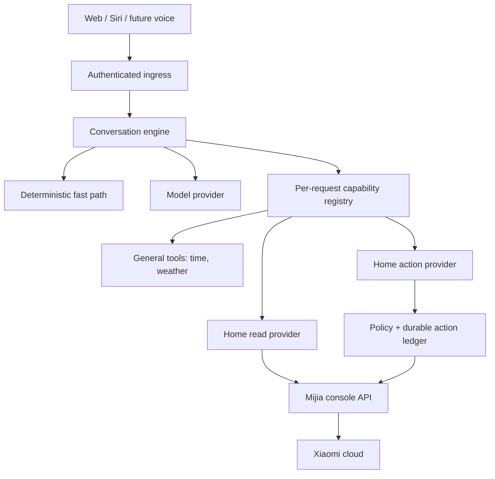
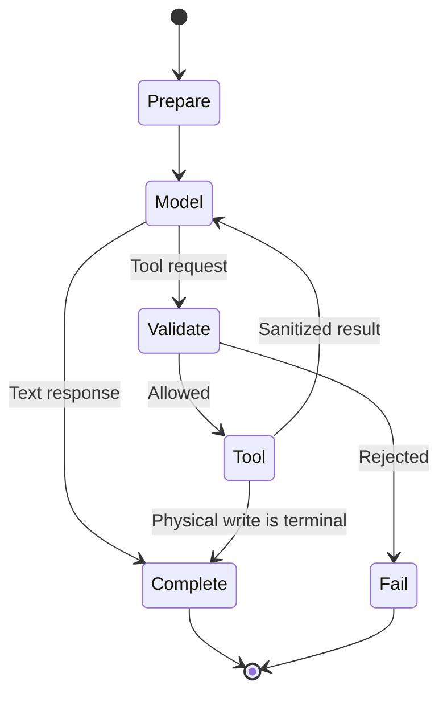

# Mijia General Home Assistant — Project Design

**Status:** Proposed clean-slate architecture  
**Date:** 2026-09-22  
**Repositories reviewed:** [`zhangys10/mijia-agent`](https://github.com/zhangys10/mijia-agent) and [`zhangys10/mijia-web-console`](https://github.com/zhangys10/mijia-web-console)  
**Decision:** Replace the scene-router mental model with a general assistant and bounded capability loop. Preserve useful security and deployment components selectively; migration compatibility is not a requirement.

## 1. Executive summary

The current project is structurally a scene-intent router:

- every non-preview turn loads scenes before asking the model;
- the system prompt defines a home-control intent router;
- the model can make only one decision and at most one tool call;
- the public command pipeline recognizes only scene activation;
- valid questions such as “今天天气怎么样” are classified as `not_understood`.

That is the wrong abstraction. The product should be a **general home assistant** that can:

1. answer ordinary questions directly;
2. retrieve current external information such as weather;
3. query current home and device state;
4. request controlled home actions such as activating a scene;
5. later support reminders and consent-based memory.

Home actions are capabilities of the assistant, not the assistant’s identity. The Xiaomi-facing console remains the deterministic executor and credential boundary. The new agent owns conversation, model orchestration, capability selection, tool-result iteration, response composition, and channel-neutral behavior.

The recommended implementation is a clean core behind thin Web, Siri, and EdgeOne adapters. It uses a per-request capability registry, a maximum-four-iteration tool loop, explicit risk classes, opt-in home exposure, and a separate durable action ledger for any physical write.

## 2. What Home Assistant demonstrates

This design borrows architectural patterns, not Home Assistant code or a mandatory Home Assistant deployment.

### 2.1 Conversation agent and home API are separate

Home Assistant represents an AI integration as a conversation entity. Home access is provided through a separate LLM API. Its built-in Assist API exposes the same bounded capabilities and exposed entities available to the built-in conversation agent, and it explicitly excludes administrative operations.

**Adopt:** keep conversation/model orchestration separate from home-domain execution and authorization.

Sources:

- [Home Assistant LLM API](https://developers.home-assistant.io/docs/core/llm/)
- [Conversation entity](https://developers.home-assistant.io/docs/core/entity/conversation/)

### 2.2 Capabilities are typed tools, assembled per request

Home Assistant integrations can contribute tools through a lazy `async_get_tools` hook. It is evaluated for each request with an `LLMContext`, so the available tools can differ by assistant, initiating device, selected API, and request context.

**Adopt:** build a `CapabilityRegistry` that assembles only the tools permitted for the authenticated turn. Tool availability must be determined by trusted server context, not model arguments.

### 2.3 A real agent feeds tool results back to the model

Home Assistant’s documented conversation flow makes tools available through a chat log and repeatedly calls the model until there are no unresponded tool results. Its sample loop permits up to ten iterations.

**Adopt with a tighter bound:** a maximum of four model iterations, eight read calls, and one physical write per user turn. Tool results become inputs to the next model step, enabling the assistant to answer naturally after obtaining data.

### 2.4 Entity exposure is opt-in and minimal

Home Assistant lets users control which devices and entities an AI can access. Its guidance recommends exposing the minimum because large catalogs reduce accuracy, increase latency, and increase token cost.

**Adopt:** build an assistant exposure projection in the console. Only explicitly exposed rooms, devices, measurements, and scenes become assistant-visible aliases. Never expose raw DIDs, MIoT addresses, credentials, or unrestricted service APIs.

Sources:

- [OpenAI conversation integration](https://www.home-assistant.io/integrations/openai_conversation/)
- [Assist best practices](https://www.home-assistant.io/voice_control/best_practices)

### 2.5 Deterministic commands can run before an LLM

Home Assistant’s “Prefer handling commands locally” path first attempts the built-in deterministic conversation agent. It uses the LLM only when the local agent does not understand the request. This reduces cost and latency for common commands while preserving general-question capability.

**Adopt selectively:** exact, unambiguous, low-risk commands may use a deterministic fast path, but only through the same policy and action ledger as model-selected actions. The LLM remains the fallback for general questions and ambiguous language.

Source: [Home Assistant Voice Chapter 9](https://www.home-assistant.io/blog/2025/02/13/voice-chapter-9-speech-to-phrase/)

### 2.6 Scripts become purpose-built tools

Home Assistant converts exposed scripts into callable tools rather than dumping them into a static entity list. Descriptions tell the model what the script does and when to use it.

**Adopt:** treat reviewed Mijia scenes as action tools or discoverable action candidates with clear descriptions and risk metadata. Do not expose a generic Xiaomi API.

Source: [Exposing scripts to LLM conversation agents](https://www.home-assistant.io/voice_control/exposing_scripts_to_llms/)

### 2.7 External capabilities can be plugged in

Home Assistant can act as an MCP client and make external tools available to conversation agents. It can therefore add web search or memory without merging those services into the home-control implementation.

**Adopt later:** define a provider-neutral capability interface now. Add a restricted MCP bridge only after native weather and home providers establish the security model. MCP-discovered tools must never be trusted or enabled automatically.

Source: [Home Assistant MCP integration](https://www.home-assistant.io/integrations/mcp)

## 3. Product definition

### 3.1 Product statement

Mijia Assistant is a multilingual, channel-neutral personal home assistant. It answers general questions, retrieves approved current information, observes the user’s home, and carries out explicitly authorized home actions through deterministic executors.

### 3.2 Initial use cases

| Category | Example | Expected behavior |
|---|---|---|
| General knowledge | “湿度多少比较舒服？” | Answer directly; no home call |
| Fresh information | “今天新加坡天气怎么样？” | Call weather provider and summarize current data |
| Missing context | “今天天气怎么样？” | Use an explicitly configured default location or ask for a city |
| Home observation | “客厅温度是多少？” | Query exposed home measurements and answer from tool data |
| Device observation | “还有哪些灯开着？” | Query exposed device state |
| Home action | “执行离家模式” | Resolve scene, apply policy, durably claim, execute once |
| Ambiguous action | “弄暗一点” | Ask a clarification; do not act |
| Conversation | “那卧室呢？” | Resolve against bounded prior context |

### 3.3 Non-goals for the first release

- No generic `call_api`, raw REST, raw MIoT, `set_property`, or arbitrary service tool.
- No locks, cameras, gas, access-control, purchase, or security-critical actions.
- No autonomous physical actions based on learned habits.
- No background reminders or proactive notifications in the first release.
- No vector database.
- No unrestricted web browser or arbitrary MCP server.
- No dependency on a Home Assistant installation.
- No requirement to preserve the existing `/ai/command` behavior or closed intent enums.

## 4. Architecture



### 4.1 Trust boundaries

| Boundary | Owns | Must never receive |
|---|---|---|
| Channel/UI | User interaction and presentation | Service secrets, Xiaomi credentials |
| Ingress adapter | Authentication, quota reservation, channel metadata | Decrypted Xiaomi session |
| Assistant core | Conversation and tool orchestration | Xiaomi credentials, real scene IDs, DIDs |
| Capability providers | Typed external/home operations | Unbounded model authority |
| Mijia console | Xiaomi credentials, device graph, aliases, execution | Model credentials and unrestricted prompts |
| Action ledger | Atomic write claims and outcomes | Xiaomi tokens or conversational content |

### 4.2 Core rule

The model may **request** a capability. It never authorizes or executes one. Authorization, exposure, argument validation, risk policy, idempotency, and final outcome are server responsibilities.

### 4.3 Platform independence as a design constraint

EdgeOne is the initial deployment platform. The current implementation may use its runtime and services directly to deliver the product; implementing a second platform or a general plugin framework is not a prerequisite. However, EdgeOne is a replaceable implementation choice, not part of the assistant's business contract. This requirement applies to all external dependencies, not only storage.

Keep conversation rules, capability schemas, authorization policy, exposure semantics, action outcomes, and public channel contracts independent of platform SDK types, headers, storage keys, and deployment layouts. Platform integration belongs at explicit boundaries owned by the repository that uses it: `adapters/edgeone` in this repository, and corresponding server-side adapters in `mijia-web-console`. The runtime entrypoint selects implementations and injects normalized configuration and dependencies. The core must not discover its runtime or select a vendor itself.

Existing direct integrations may remain during incremental delivery, but must be recorded as coupling to remove when that boundary is refactored or replaced. New changes must avoid spreading that coupling into additional business modules. Small interfaces around actual operations are sufficient; do not build a generic SDK abstraction or require multiple production backends in advance. Section 16.3 records the required boundaries, current EdgeOne choices, and replacement criteria. These are design requirements, not a claim that every adapter already exists.

## 5. Request lifecycle

### 5.1 Turn processing

1. Ingress authenticates the caller and creates trusted `AssistantContext`.
2. The conversation store loads a bounded model-history projection.
3. The deterministic recognizer may handle a known safe command.
4. Otherwise, the registry assembles tools for this specific request.
5. The model receives the general-assistant prompt, bounded history, channel hints, and tool schemas.
6. If the model returns an answer, the engine completes the turn.
7. If the model requests tools, the engine validates each call, executes permitted tools, and appends sanitized tool results to the ephemeral model transcript.
8. The model produces a grounded final response or another allowed tool request.
9. The engine stops after four model iterations, eight reads, one write, deadline exhaustion, cancellation, or an uncertain write outcome.
10. The engine persists the display transcript and a separately redacted model-history projection.

### 5.2 Tool loop



### 5.3 Loop limits

- Maximum model iterations: 4.
- Maximum read tool calls: 8 total, 4 per tool.
- Maximum physical writes: 1.
- Writes cannot be parallelized with any other tool call.
- A write result is terminal; the model cannot request another action afterward.
- A timeout after write dispatch becomes `outcome_unknown`; it is never retried automatically.
- Overall interactive deadline: channel-specific, initially 20 seconds Web and 12 seconds Siri, with a stricter provider timeout budget inside it.

## 6. Assistant context

Trusted context is constructed by the ingress and is never accepted from model tool arguments.

```python
class AssistantContext:
    request_id: str
    conversation_id: str
    principal_ref: str        # opaque, server-only
    home_ref: str | None      # opaque, server-only
    channel: Literal["web", "siri", "voice", "automation"]
    locale: str
    timezone: str
    initiating_device_ref: str | None
    scopes: frozenset[str]
    consent: ConsentSnapshot
    deadline: datetime
```

The model may see locale, timezone, channel response style, and selected non-sensitive preferences. It must not see principal references, home references, session bindings, automation tokens, DIDs, real scene IDs, internal URLs, or service secrets.

## 7. Capability framework

### 7.1 Capability contract

```python
class Capability(Protocol):
    name: str
    description: str
    risk: RiskClass
    input_schema: dict

    async def is_available(self, ctx: AssistantContext) -> bool: ...
    async def invoke(self, ctx: AssistantContext, args: dict) -> CapabilityResult: ...
```

```python
class CapabilityResult:
    status: Literal["success", "partial", "error", "outcome_unknown"]
    model_content: dict | str | None
    client_data: dict | None
    display_text: str | None
    persistence: Literal["full", "redacted", "none"]
    is_terminal: bool
```

`model_content` is a sanitized, bounded view used only inside the current turn. `client_data` is the authoritative structured payload. `display_text` supports clients that cannot render structured cards. Persistence policy controls what enters future model context.

### 7.2 Risk classes

| Class | Examples | Default policy |
|---|---|---|
| `general_read` | time, weather | Automatic after schema validation |
| `home_read` | temperature, powered-on devices | Requires authenticated home membership and exposure |
| `home_write_low` | reviewed scene activation | Requires scope, explicit present intent, durable claim |
| `home_write_high` | locks, security, gas | Not registered |
| `external_write` | messages, purchases | Not registered in initial project |

### 7.3 Initial tool catalog

| Tool | Risk | Notes |
|---|---|---|
| `get_current_datetime` | general read | Server clock with requested/authorized timezone |
| `get_weather` | general read | Current conditions and forecast from configured provider |
| `list_home_capabilities` | home read | Sanitized rooms, measurement types, device kinds, scenes |
| `get_home_environment` | home read | Temperature, humidity, air quality; exposed sources only |
| `get_device_status` | home read | Sanitized state projection; no raw IDs |
| `find_scenes` | home read | Returns matching opaque aliases and descriptions |
| `activate_scene` | home write low | Accepts only an alias returned by trusted discovery in this turn |

`activate_scene` is not exposed when the scope, durable ledger, console execution gate, or approved scene revision is unavailable.

## 8. General answers and current information

### 8.1 Direct model answers

The system prompt defines a helpful general assistant, not an intent router. The model may answer stable general-knowledge questions directly. It must not claim knowledge of current, private, or home state without a successful tool call.

### 8.2 Weather capability

**Decision:** use [Caiyun Weather v2.6](https://docs.caiyunapp.com/weather-api/v2/v2.6/6-weather.html) as the Phase 1 native weather provider. The MVP is mainland China only.

Why it fits:

| Concern | Assessment |
|---|---|
| China coverage | Caiyun’s v2.6 weather endpoint is selected for this China-only MVP and accepts a longitude/latitude target |
| Data | One combined request returns realtime and daily weather; realtime is published on a minute cadence, while daily forecasts are batch-published |
| Authentication | Use Caiyun’s recommended signed App Key/App Secret mode: a per-request HMAC signature, nonce, and timestamp. The App Secret stays server-only and neither credential enters model context, client responses, or logs |
| Latency | Accept only after an EdgeOne deployment probe demonstrates p95 ≤ 1.5 seconds and p99 ≤ 3 seconds from intended China execution paths |
| Alerts | The API can return alerts only when explicitly requested with an entitled token. Phase 1 sends `alert=false` and returns `alertsSupported: false` until alert policy is designed |

References: [combined weather endpoint](https://docs.caiyunapp.com/weather-api/v2/v2.6/6-weather.html), [realtime fields](https://docs.caiyunapp.com/weather-api/v2/v2.6/1-realtime.html), and [daily fields](https://docs.caiyunapp.com/weather-api/v2/v2.6/4-daily.html).

The adapter caches normalized results for five minutes by resolved place, language, and forecast window. Use a three-second provider deadline with no automatic retry. The server resolves a user-supplied China city or area name with AMap, then sends only its coordinates to Caiyun; coordinates are never requested from or shown to users. Lookup failures receive a generic retry-later response. A forecast remains useful when alerts are unavailable, but the result must explicitly contain `alertsSupported: false`.

**MCP decision:** do not use Caiyun’s MCP server for the MVP. It exposes multiple remote tools, including historical data and alerts, while this agent needs one locally versioned schema, fixed request budget, deterministic result projection, and no model-visible credential path. Re-evaluate MCP only when multiple independently administered providers justify a restricted MCP adapter.

Location resolution order:

1. a city or area name explicitly stated in the current request;
2. an explicit, user-configured default place;
3. a consented coarse home-location projection from the console;
4. otherwise ask a clarification question.

Never infer location from `homeId`, home name, IP address, or timezone. Tool output includes provider, observation/forecast timestamp, timezone, units, and freshness. The assistant must identify stale or unavailable data rather than guessing.

Initial implementation should use one native weather provider behind a small interface:

```python
class WeatherProvider(Protocol):
    async def forecast(self, location: WeatherLocation, days: int) -> WeatherSnapshot: ...
```

Do not introduce MCP merely to obtain weather. MCP becomes useful when multiple separately administered external capability providers are needed.

## 9. Home semantic layer and exposure

### 9.1 Assistant-visible projection

The console should expose a versioned, sanitized projection:

- room/floor display names and aliases;
- exposed device display names, kind, room, supported read capabilities;
- exposed measurement types and source labels;
- reviewed scene aliases, names, descriptions, revision hashes, and risk class;
- freshness and completeness metadata.

It must exclude raw device identifiers, MIoT SIID/PIID values, account identifiers, credentials, topology evidence not approved for exposure, and unrestricted action names.

### 9.2 Opt-in exposure

Exposure is configured once per home and shared by every currently authorized member of that home. Authorization is still checked per principal on every request, but members do not maintain divergent exposure lists. Defaults should be conservative:

- read-only environmental measurements may be suggested for exposure;
- devices and scenes are opt-in;
- sensitive device categories are never eligible;
- the user can inspect and revoke exposure;
- changes take effect without redeploying the agent.

For the initial Mijia-only release, `mijia-web-console` owns the complete entity inventory and the exposure UI. Add **Home → AI Assistant Access** with:

- a home-level assistant enable switch;
- room and environmental-measurement read toggles;
- device-state read toggles;
- scene execution toggles with risk, confirmation, and current revision badges;
- source, last-sync, last-modified, and “changed since approval” indicators;
- one action to revoke all assistant access.

The settings inventory must be grounded in the console's current read results: offer a
room/measurement pair only when the environment collector has returned a valid reading
for that pair, and offer a device only when it appears in the shared device-status
projection. Do not construct a room × metric grid from the static metric vocabulary or
offer every discovered device as a status source. A temporarily missing reading is
unavailable for new approval; existing grants remain stored until the user saves a
revised configuration. The tool boundary still rechecks exposure on every invocation.

Store exposure against provider-neutral keys such as `provider + providerEntityRef`. Initially `provider=mijia`; a future Home Assistant provider can appear as another source without changing the agent contract or the per-home sharing rule.

### 9.3 Lazy discovery

Generic questions must not call the console or load a scene catalog. Home capabilities are fetched only after the model or deterministic recognizer selects a home-related operation. Cache only sanitized projections, bounded by home, principal authorization, revision, and short TTL.

## 10. Physical action safety

### 10.1 Authorization conditions

All conditions must pass:

- authenticated current home membership;
- required action scope;
- scene is exposed, enabled, approved, and revision-matched;
- scene risk class is permitted;
- request expresses explicit present-tense intent or uses a valid confirmation ticket;
- alias was discovered through trusted context;
- durable idempotency claim acquired atomically;
- execution feature gate enabled.

### 10.2 Durable action ledger

The existing idempotency key remains the request identity, but a key by itself is not an execution guarantee. The console must persist and atomically claim it across workers, deployments, retries, and conversations.

**Initial implementation decision:** the authoritative ledger runs in `mijia-web-console` on EdgeOne Blob, not EdgeOne KV. Blob provides strong-consistency reads and conditional create through `setJSON(key, value, {onlyIfNew: true})`. KV may serve quotas or caches, but its other edge nodes can read stale values for up to 60 seconds. The portable contract is an atomic durable claim, immutable outcome records, and authoritative replay reads; a replacement must preserve those semantics, not reproduce the Blob API. See §16.3 for migration and validation requirements.

The claim key is a digest of `environment + principal + home + idempotency_key`. The immutable claim contains:

- canonical request hash;
- capability and opaque target alias;
- approved target revision;
- principal/home scope digests and creation timestamp.

Separate immutable lifecycle records represent `dispatched`, `succeeded`, `partial`, `failed`, or `unknown`, plus bounded sanitized outcomes and reconciliation attempts.

Claim acquisition uses `onlyIfNew`. On a duplicate, the console performs a strong read:

- same canonical request hash: return the recorded outcome or `pending/unknown` without redispatching;
- different request hash: reject with `IDEMPOTENCY_KEY_REUSED`;
- `dispatched` without a final outcome: return `outcome_unknown` and reconcile, never execute again.

Because the documented Blob API provides create-if-absent but not a general compare-and-swap update, use immutable objects rather than racing overwrites:

```text
actions/claims/{claimHash}.json
actions/dispatched/{claimHash}.json
actions/outcomes/{claimHash}.json
actions/reconciliation/{claimHash}/{attemptId}.json
```

Each authoritative object is written with `onlyIfNew`; reads and reconciliation listings use strong consistency. A derived mutable status object may be maintained for convenience but is never authoritative. Phase 0 must concurrency-test `onlyIfNew` from multiple deployed workers and document the exact conflict response before physical execution is enabled.

Conversation deletion never deletes action receipts. EdgeOne KV and process-local locks are not suitable as the authoritative ledger.

References: [EdgeOne Blob](https://pages.edgeone.ai/zh/document/blob-storage) and [EdgeOne KV](https://pages.edgeone.ai/document/kv-storage).

### 10.3 Response authority

The executor result is authoritative. Model-generated text never changes `success`, `partial`, `failed`, or `unknown`. For actions, prefer deterministic server-generated confirmation text based on the executor result.

## 11. Conversation, transcript, and memory

### 11.1 Separate display transcript from model history

The user may need to see or hear an exact temperature, while future model turns should not automatically receive all historical measurements. Store two projections:

- **display transcript:** user-visible response and structured cards;
- **model history:** bounded, redacted conversational content.

For example, the display transcript can contain “客厅目前 25.5°C,” while model history stores “Answered the user’s current living-room temperature query.” Tool results are ephemeral by default.

### 11.2 EdgeOne Makers storage adapter

EdgeOne Makers `context.store` is suitable as the persistence backend. Its generic message API and framework conversation/session storage are explicitly separate, persist across instances through platform Blob storage, and are available from both Agent and Cloud Function runtimes.

Keep persistence behind a repository-owned `ConversationRepository`; do not couple the conversation engine directly to `context.store`:

- generic `appendMessage` / `getMessages` stores the exact display transcript and structured card metadata;
- the `context.store.state` key `model_history_v1` stores the bounded redacted model-history projection;
- framework-native session adapters are optional and must not persist raw private tool results behind the repository's redaction policy;
- stop/delete/history endpoints call the same repository, so platform replacement remains possible.

This uses Makers storage rather than introducing an external database while preserving the product's two-projection privacy contract. Cross-instance persistence requires EdgeOne CLI 1.6.26 or later.

`context.store` and direct Blob SDK calls are distinct platform integrations. The former supplies platform-managed conversation persistence; the latter is used by console-owned exposure and action storage. Keep both behind their own domain operations rather than exposing either API to the engine. The conversation contract must define ordering, retention, scoped identity, deletion, and failure behavior so a replacement can preserve them independently of Makers conversation IDs and storage layout (§16.3).

Reference: [EdgeOne Makers conversation management](https://cloud.tencent.com/document/product/1552/132787).

### 11.3 Initial memory

- Last 12 redacted user/assistant messages.
- No automatic preference extraction.
- No persisted tool payloads.
- No action authority derived from history.
- Explicit conversation delete removes transcript and model history, not audit/action receipts.

### 11.4 Future memory

Later phases may add:

1. bounded conversation summary;
2. explicit user preferences with inspect/edit/delete and consent;
3. versioned home semantics from the console.

Learned habits can produce suggestions, never silent physical actions.

## 12. API design

### 12.1 Canonical internal turn API

```json
POST /internal/v1/assistant/turn
{
  "requestId": "req_...",
  "conversationId": "conv_...",
  "message": "今天新加坡天气怎么样？",
  "locale": "zh-CN",
  "timezone": "Asia/Shanghai",
  "channel": "web",
  "idempotencyKey": "...",
  "trustedBinding": "opaque"
}
```

Principal, home, scopes, consent, and exposure are resolved from authenticated server context. They are not caller-selectable model fields.

### 12.2 Canonical response

```json
{
  "requestId": "req_...",
  "conversationId": "conv_...",
  "status": "completed",
  "outcome": "tool_answer",
  "answer": {
    "text": "新加坡今天炎热并有阵雨可能。",
    "speak": true,
    "continueConversation": false
  },
  "data": {
    "type": "weather",
    "capturedAt": "2026-09-22T...Z",
    "freshness": "fresh"
  },
  "toolEvents": [
    {"name": "get_weather", "status": "success"}
  ],
  "usage": {
    "promptTokens": 0,
    "completionTokens": 0,
    "totalTokens": 0,
    "estimated": false
  }
}
```

`outcome` values:

- `direct_answer`
- `tool_answer`
- `clarification`
- `action_result`
- `refused`
- `failed`
- `outcome_unknown`

A valid non-home question is never represented as `not_understood` merely because it does not map to a scene.

### 12.3 Channel adapters

- Web can render structured data and longer text.
- Siri calls the canonical agent endpoint directly with an automation token and receives short speakable text with no Markdown.
- Voice can use streaming later, but tool calls still follow the same core.
- Automation requests may disallow clarification and return a structured error instead.

All channels invoke the same conversation engine and capability policies.

The Siri token is carried only in the authorization header, never in request content, model input, transcript, or logs. The console issues a revocable, audience-bound token. The agent validates the outer authorization envelope at ingress but cannot decrypt Xiaomi credentials; an opaque console grant is forwarded only if a home capability is invoked. Generic Siri questions therefore do not require a home-provider call after ingress authentication.

## 13. Proposed source layout

```text
src/mijia_assistant/
  api/
    app.py
    models.py
    errors.py
  conversation/
    engine.py
    prompt.py
    history.py
    response.py
  capabilities/
    base.py
    registry.py
    policy.py
    datetime_tool.py
    weather/
      models.py
      provider.py
      tool.py
    home/
      provider.py
      models.py
      environment.py
      devices.py
      scenes.py
  providers/
    base.py
    openai_compatible.py
  security/
    context.py
    action_ledger.py
    sanitization.py
  adapters/
    mijia_console.py
    edgeone.py
  observability/
    events.py
    metrics.py
tests/
  unit/
  contract/
  integration/
  safety/
```

The package may keep the repository name `mijia-agent`; the code should use a capability-neutral package name such as `mijia_assistant`.

## 14. Existing project reuse assessment

Migration compatibility is not a goal. “Reuse” means preserving a sound concept or small implementation, not retaining current module boundaries.

| Existing area | Decision | Rationale / destination |
|---|---|---|
| `config.py` URL validation, secret separation, model allowlist | Reuse with adaptation | Sound defaults; expand to provider, loop, weather, deadlines, feature gates |
| `gateway.py` transport hardening, usage parsing, redirect policy | Reuse concepts, rewrite interface | Must support normalized streaming/non-streaming events and repeated tool calls |
| `llm_log.py` non-fatal logging | Reuse concept only | Replace raw prompt logging with structured redacted events and configurable sampling |
| `app.py` internal auth, body limits, no-store responses, redacted errors | Reuse heavily | Collapse duplicated ingress behavior around one canonical engine |
| `console.py` strict response parsing and no write retry | Reuse heavily | Rename/consolidate as `MijiaHomeProvider`; add exposure projection and discovery |
| `command_console.py` automation-token forwarding | Adapt in channel ingress | Do not keep a separate command brain |
| `service.py` | Replace | Single-step closed enum and eager scene fetch encode the wrong architecture |
| `command_service.py` | Replace | Duplicated scene-only orchestration |
| `command_rules.py` | Split and mostly replace | Retain sanitizers and conservative action phrases inside scene policy; replace router prompt |
| `models.py` home status validation | Reuse selected domain models | Rebuild result/decision types around capability-neutral outcomes |
| `command_models.py` | Replace | `intent=activate_scene|none` and `not_understood` are product-level constraints to remove |
| `command_idempotency.py` | Do not use for writes | May remain an in-process optimization for reads; never authoritative |
| EdgeOne `shared.ts` auth, scoped IDs, stop/delete plumbing | Reuse after audit | Keep adapter thin; update canonical API and history projections |
| EdgeOne receipt state | Replace for actions | Conversation replay cache is not an atomic physical-action ledger |
| EdgeOne bounded history | Reuse concept | Store separate display/model projections and explicit retention |
| `local_prod.py` / `mijia-agent-local-prod` | Reuse the hardened harness; replace its protocol | Keep configuration checks, secret isolation, production acknowledgement, token workflow, loopback server lifecycle, and conservative transport behavior. Replace legacy router imports, `/ai/command`, payload/response models, history behavior, and scene-intent rendering. Never auto-fallback to the legacy route. |
| Existing safety/credential tests | Port | Invariants remain valuable; behavior fixtures must be rewritten |
| Deployment files and CI | Reuse | Update package paths and add provider contract suites |
| Existing architecture/alignment docs | Archive as historical | They describe a scene-router migration, not the new product |

### 14.1 Legacy router deprecation and removal

The existing scene-router implementation is deprecated immediately. This includes:

- `service.py` single-step scene orchestration;
- `command_service.py` and its duplicated command pipeline;
- the router-specific parts of `command_rules.py`;
- `command_models.py` closed intent/result types;
- legacy endpoints, configuration, fixtures, and tests used only by those paths.

During implementation:

- do not add capabilities or product behavior to the legacy routers;
- allow only critical security or production-stability fixes;
- direct every new caller and test to the canonical conversation engine;
- keep legacy access behind an explicit deployment flag and emit a structured deprecation/traffic metric;
- never fall back automatically from the canonical engine to a legacy action path, because that could bypass the new policy or duplicate a physical action.

The legacy code is temporary rollback support, not a compatibility requirement. It is removed as part of core-project completion when all of these gates pass:

1. Web and Siri use only the canonical assistant endpoint.
2. Direct answers, weather, home reads, and approved scene actions pass their acceptance and safety suites.
3. The Blob action ledger and scene revision checks are enabled in production.
4. Legacy-router traffic is zero for one production observation window, with a minimum of 14 days.
5. Operators approve removal and the canonical deployment has an independent rollback artifact.

Removal deletes the modules above plus their routes, closed-intent schemas, feature flag, environment variables, router prompts, obsolete tests, and deployment wiring. Reusable sanitizers or policy phrases must be moved first into capability-neutral modules; nothing imports back from a deprecated router after deletion.

### 14.2 Phase 0 local-test CLI assessment

The existing `mijia-agent-local-prod` CLI can remain the Phase 0 operator smoke-test client, but it cannot validate the new assistant unchanged. Today it starts the real local ASGI application and safely connects that process to production Gateway and console services; it then calls the legacy `POST /ai/command` scene-router contract, validates `CommandRequest`/`CommandResponse`, maintains legacy client-side history, and renders closed scene intent fields. It is therefore a **local process using production dependencies**, not an offline local assistant test.

Retain these tested parts:

- strict, non-evaluating environment-file parsing and an explicit child-process environment allowlist;
- redacted `check` output, HTTPS/non-loopback production target validation, and the exact production-use acknowledgement;
- console-owned automation-token generation, protected cookie/token/log files, and avoidance of secrets in arguments and child environments;
- loopback Uvicorn startup, readiness polling, bounded shutdown, proxy bypass, redirect refusal, no automatic write retry, and visible unknown outcomes;
- one-shot and interactive workflows, with real-model cost and production-data warnings.

Replace these dependencies before the CLI counts toward Phase 0 acceptance:

- imports from `command_models` and `command_rules`;
- the `/ai/command` endpoint and its scene-router request/response contract;
- `intent`, `sceneName`, and `decisionSource` rendering;
- client-managed legacy history as an implicit source of truth;
- any automatic compatibility fallback to the deprecated router.

Retarget the CLI to the canonical assistant endpoint and normalized turn/result events. It should render answer text, outcome, capability/tool events, action outcome, and usage without interpreting vendor-specific fields. Conversation state must go through the same `ConversationRepository` behavior as other callers; a stateless local mode may exist only when named explicitly.

Use the existing executable name during Phase 0 to avoid creating a second test harness. Define three explicit workflows:

| Command | Network and credentials | Purpose |
|---|---|---|
| `mijia-agent-local-prod check` | No network | Validate configuration, model allowlist, URL policy, file permissions, and selected test profile without printing secrets |
| `mijia-agent-local-prod smoke --profile fake` | Local only; no Xiaomi token or production model key | Run deterministic direct-answer, clarification, fake-weather tool-loop, malformed-tool, deadline, and policy-rejection cases |
| `mijia-agent-local-prod run --profile live-read` | Real Makers AI Gateway and production console read APIs | Exercise the selected `AI_GATEWAY_MODEL`, tool-call continuation, usage reporting, authorization, and exposed home reads; warn that this incurs cost and accesses real home data |

Phase 0 must keep physical writes unavailable in both profiles. Generic and fake-weather cases must not require a Xiaomi cookie, automation token, console checkout, or home-provider call. Live-read may reuse the existing console token generator, but only for authorize and read capabilities. Each request gets a visible request/idempotency identifier; ambiguous results are never retried automatically.

The CLI is not evidence that EdgeOne routing, Makers `context.store`, quota settlement, cross-worker Blob claims, transcript persistence, or a real physical action works. Those require deployment-path contract and runbook tests. If a temporary legacy mode is retained for comparison, it must be selected explicitly, emit deprecation telemetry, and must not be reachable as a fallback from canonical mode.

Phase 0 CLI acceptance requires all of the following:

1. `check` performs no network access and redacts every secret.
2. Fake smoke proves a direct answer and a two-step weather tool loop without loading the console provider.
3. Live-read proves the configured model's tool continuation and usage normalization, plus exposed environment or device reads.
4. A requested physical write is rejected before dispatch.
5. Malformed tool arguments fail closed; timeouts and ambiguous outcomes are surfaced without retry.
6. Token, cookie, prompt, tool result, and log handling preserve the repository's existing credential-isolation invariants.

## 15. `mijia-web-console` as the home-tool API

The console is already the correct trust boundary for Xiaomi access. It owns Xiaomi sessions, derives the principal, verifies current home membership, maps opaque scene aliases, and sanitizes home state. The agent should not duplicate any of those responsibilities.

The current implementation is a strong starting point, not the finished assistant contract. The retiring `POST /api/ai/tools` dispatch switch has two authenticated request envelopes:

- a service request carrying a verified session binding, principal, home, and scopes; or
- a service request plus `X-Ai-User-Token`, from which the console derives the principal and resolves the permitted home.

Both paths correctly keep Xiaomi credentials inside the console. They also enforce a 32 KiB body limit, strict arguments, `Cache-Control: no-store`, redacted errors, and a fresh home-membership check. Those properties should be retained. Phase 1 canonical Web, Siri, and local production testing standardize on the automation-token envelope; the session-binding path is legacy-only and receives no new assistant behavior.

### 15.0 Phase 1 canonical context and follow-on gates

The canonical Phase 1 flow is deliberately read-only:

```text
authenticated Web/Siri ingress
  -> short-lived opaque automation token
  -> Makers adapter authorize(token)
  -> console re-derives principal and home
  -> adapter compares trusted context before loading history
  -> Python capability loop
  -> console is called with the same token only for a selected home read
```

The token, Xiaomi session, principal/home identifiers, and tool responses are never model
input or normal logs. The token payload's identity fields are not authoritative: only the
console's fresh `authorize` result may establish the adapter's principal/home context.

`idempotencyKey` is a request/receipt identity, not permission. It may support duplicate
read replay today, but it must never make an untrusted client eligible for `scene:activate`.
Phase 1 therefore exposes only `ai:chat`, and it registers no physical-write capability.

Subsequent work must preserve this sequence:

1. **Home-read maturity:** add the versioned manifest and filtered read APIs below, plus
   explicit home-level exposure policy. Keep the automation-token envelope; do not revive
   session binding as a second canonical path.
2. **Action prerequisites:** add reviewed scene aliases, exposure and scene revisions, risk
   classification, explicit confirmation where required, and a console-owned durable Blob
   action ledger. The ledger claim must use principal, home, idempotency key, canonical action
   hash, and revision; it must be atomically created before Xiaomi dispatch.
3. **Action registration:** only after the prerequisites have deployed and concurrency-tested,
   let the console issue/confirm an action scope from trusted context. The adapter/Python must
   still treat that scope as server-derived and must allow one terminal write with no retry.
4. **Legacy retirement:** move every remaining caller to the canonical token envelope, observe
   zero session-binding traffic for the agreed window, then delete the session-binding route,
   schemas, tests, and deployment configuration together. Do not keep fallback behavior.

### 15.1 Current API inventory

| Current tool | Current behavior | Design decision |
|---|---|---|
| `authorize` | Validates the request context and returns `{ok: true}` | Retain as an internal health/auth operation, not a model-visible tool |
| `list_scenes` | Returns enabled manual scenes as principal/home-scoped opaque aliases, names, generic descriptions, and action counts | Reuse aliasing; replace the coarse catalog with exposure, revision, risk, and searchable summaries |
| `get_home_status` | Returns sanitized temperature, humidity, air-quality, pressure, and battery readings with completeness and warnings | Reuse collector; expose to the agent as filtered `get_home_environment` |
| `get_device_status` | Returns bounded room/device projections with `on`, `off`, or `unknown` and online state | Reuse collector; add assistant exposure and validated room/kind/state filters |
| `activate_scene` | Validates scope, alias, arguments, and idempotency, then always rejects execution; preview is read-only | Keep disabled until the durable ledger, revision binding, risk policy, and feature gate exist |

The environment collector already has several desirable semantics: it reads public MIoT specifications, selects readable properties, normalizes units, batches property reads, filters offline sources, preserves partial failures, and omits raw Xiaomi identifiers. The device collector uses the same synchronized device-management model as the dashboard, preserves `unknown`, omits raw IDs/spec tuples, and bounds its result size. These should become implementations behind provider-neutral agent capabilities rather than be rewritten from scratch.

### 15.2 Gaps in the current console contract

1. **No assistant exposure policy.** Status tools return all eligible home data, and `list_scenes` returns every enabled manual scene. Enabled in Xiaomi is not equivalent to approved for AI.
2. **No capability manifest.** The agent must already know a hard-coded list of console operations and schemas.
3. **No filtered reads.** Both status tools require empty arguments, so a question about one room retrieves the whole bounded home projection.
4. **Scene aliases are not revision-bound.** Editing a scene does not change its alias, so a previously reviewed action can silently acquire different semantics.
5. **Scene summaries are too weak for safe selection.** The agent receives a generic description and action count, but no sanitized action summary, risk class, or revision.
6. **No durable action ledger.** Request validation and an idempotency string do not provide an atomic, cross-process execution claim.
7. **No physical execution path.** `runManualScene` exists in the console's Xiaomi layer, but the remote assistant route intentionally never calls it.
8. **Fixed dispatch is not dynamic capability assembly.** It cannot express per-home/per-principal availability without adding policy outside the route.

### 15.3 Recommended versioned internal API

Because migration compatibility is not required, add a versioned assistant API and retire the existing route after its callers are moved:

```text
POST /api/internal/assistant/v1/capabilities
POST /api/internal/assistant/v1/tools:invoke
```

Both endpoints resolve the canonical automation-token envelope into one internal `ResolvedHomeContext`. This context—not model input—contains the principal, selected home, scopes, preview mode, exposure revision, and authorization expiry. Do not add a second runtime path merely to preserve session-binding compatibility.

`capabilities` returns a bounded, sanitized manifest such as:

```json
{
  "contextVersion": "1",
  "exposureRevision": "exp_...",
  "capabilities": [
    {"name": "get_home_environment", "available": true, "risk": "home_read"},
    {"name": "get_device_status", "available": true, "risk": "home_read"},
    {"name": "find_scenes", "available": true, "risk": "home_read"},
    {"name": "activate_scene", "available": false, "risk": "home_write_low"}
  ],
  "projection": {
    "rooms": ["客厅"],
    "measurementTypes": ["temperature", "humidity"],
    "deviceKinds": ["light"],
    "roomMetrics": {"客厅": ["temperature", "humidity"]},
    "roomDeviceKinds": {"客厅": ["light"]},
    "sceneSearchAvailable": true
  }
}
```

The agent owns the model-facing JSON Schemas and never injects arbitrary remote descriptions or schemas into the model prompt. For a home question, the model first selects a local discovery tool. The agent fetches the exposure manifest, then generates home-read tool schemas constrained to those approved rooms, measurements, and device kinds. A selected read tool makes one `tools:invoke` request; the console independently rechecks current availability, authorization, and exposure. It reuses one device discovery for inventory validation and the selected collector. For environment reads, it intersects requested filters with current exposure before collecting and batches MIoT reads for those pairs. The agent validates arguments against the manifest before sending them. The console returns sanitized results, and the agent sends those results together with the original question to the model for its final answer. Generic questions do not fetch a home manifest.

`tools:invoke` uses a strict union keyed by a known operation:

| Operation | Arguments | Result / policy |
|---|---|---|
| `get_home_environment` | optional exposed `rooms` and `metrics` | Sanitized readings, completeness, warnings, and `capturedAt` |
| `get_device_status` | optional exposed `rooms`, closed-set `kinds`, and `states` | Sanitized bounded devices; `unknown` remains `unknown` |
| `find_scenes` | bounded text `query` | Exposed opaque aliases, revision, sanitized action summary, and risk |
| `get_scene_details` | `sceneAlias` | Current exposed revision and enough detail to clarify or confirm safely |
| `activate_scene` | `sceneAlias`, `expectedRevision`, and policy-issued confirmation proof when required | Terminal action result after atomic claim; never retried blindly |

The console must validate every filter against the exposure projection. Filters reduce disclosure; they never grant access. Home and principal identifiers remain derived from trusted context.

### 15.4 Exposure, revision, and execution ownership

Add an explicit per-home assistant exposure record covering rooms, measurements, devices, and scenes. Every authorized member of the home shares this configuration. Default to nothing exposed. The console UI is the natural place to manage it because that application already presents the authoritative home model.

For a scene, store or derive:

- an opaque alias scoped to principal and home;
- an `exposureRevision` for the approval configuration;
- a `sceneRevision` derived from normalized action semantics;
- a sanitized summary and risk classification;
- confirmation requirements and whether execution is enabled.

The console owns the final authorization and durable action ledger because it is the only component allowed to execute against Xiaomi. The agent can collect intent and confirmation, but it cannot authorize itself. Immediately before execution, the console re-resolves the alias, checks exposure and both revisions, claims the idempotency key atomically, and invokes `runManualScene` once. Ambiguous transport outcomes become `outcome_unknown`, never an automatic retry.

Generic capabilities such as weather, date/time, and general answers do not belong in `mijia-web-console`. The console is a home capability provider; the agent composes it with non-home providers.

### 15.5 APIs that must not become model tools

Do not expose raw Xiaomi/device-control routes, raw device/spec records, arbitrary MIoT property writes, automation editors, token/session APIs, or `runManualScene` directly to the model. They remain internal implementation details behind narrow, policy-checked capabilities.

## 16. Provider portability

### 16.1 Home providers

The core should not assume Xiaomi is the only home backend:

```python
class HomeCapabilityProvider(Protocol):
    async def exposed_capabilities(self, ctx: AssistantContext) -> HomeProjection: ...
    async def environment(self, ctx: AssistantContext, query: EnvironmentQuery) -> HomeEnvironment: ...
    async def device_status(self, ctx: AssistantContext, query: DeviceQuery) -> DeviceSnapshot: ...
    async def find_scenes(self, ctx: AssistantContext, query: str) -> list[SceneCandidate]: ...
    async def activate_scene(self, ctx: AssistantContext, alias: str, claim: ActionClaim) -> ActionResult: ...
```

Initial provider: Mijia console. Future provider: Home Assistant Assist API or a custom HA integration. This allows adopting Home Assistant later without contaminating the conversation core with HA entity IDs or service calls.

### 16.2 Makers model configuration and compatibility

The model provider is deployment configuration, not an architecture decision. EdgeOne Makers supports built-in Makers Models, hosted vendor keys, and custom OpenAI-compatible base URLs. `AI_GATEWAY_MODEL` selects the exact model; `AI_GATEWAY_BASE_URL` and `AI_GATEWAY_API_KEY` select a native or custom gateway when required. Official Makers documentation currently lists integrations for OpenAI, Anthropic, Google AI Studio, DeepSeek, MiniMax, Hunyuan, Zhipu, and Moonshot AI.

Do not infer behavioral compatibility from the provider name or a successful text response. Maintain an exact-model allowlist whose fixtures and staging smoke tests verify:

- assistant-to-tool-call and tool-result-to-assistant continuation;
- stable tool-call IDs and malformed argument handling;
- streaming delta ordering and exactly one terminal event;
- parallel call normalization and enforcement of the one-write rule;
- prompt, completion, cached, and total usage parsing when supplied;
- explicit `estimated=true` accounting when the selected model/gateway omits usage.

At startup, `AI_GATEWAY_MODEL` must match a validated entry. Changing it is a configuration-only deployment, but production promotion requires rerunning the model contract suite. The engine consumes normalized events and never branches on a vendor name.

The current deployment continues to require the configured Makers AI Gateway. Portability is not permission to add user-supplied keys, direct-provider fallback, or silent failover. A future gateway replacement is an explicit operator-controlled adapter and configuration change with the same credential isolation, model allowlist, usage accounting, and contract validation.

References: [Makers Agent quick start and model selection](https://cloud.tencent.com/document/product/1552/132786) and [Makers Models overview](https://cloud.tencent.com/document/product/1552/132748).

### 16.3 Platform and infrastructure dependencies

The following inventory covers both companion repositories. Boundary names describe target responsibilities; they do not assert that named interfaces have already been implemented. Each integration should document its owner, configuration, required guarantees, normalized errors, and replacement procedure alongside the adapter.

| Dependency | Current EdgeOne integration | Required replaceable boundary and guarantees |
|---|---|---|
| HTTP hosting and routing | Console Edge Functions, Makers Agent routes, Python Cloud Functions; file routing and platform path-prefix handling | Ingress adapters translate requests into the canonical assistant/tool contracts. A different HTTP or ASGI host must preserve authentication, body limits, no-store responses, status/error codes, and channel behavior without changing conversation logic. Deployment prefixes and file layout stay outside the core. |
| Runtime configuration and secrets | Edge/Agent `context.env`, Node `process.env`, Python environment injection, platform bindings and deployment credentials | Entry adapters construct validated configuration and inject it. Shared business modules must not assume a Node global, an Edge context, or an automatically injected binding. Normalize local, test, preview, and production policy explicitly; preserve secret separation and preview's prohibition on model/device access. |
| Model access | Makers AI Gateway, model identifiers, provider-specific request/stream/usage formats | A model provider normalizes messages, tool calls, stream events, usage, deadlines, and failures. Replacing the gateway preserves the configured model allowlist, bounded loop, credential isolation, and explicit handling of unknown usage; no automatic provider fallback. |
| Conversation persistence | Makers `context.store` message and state APIs backed by platform Blob | `ConversationRepository` owns display/model projections, scoped conversation identity, ordering, retention, deletion, and replay state. Vendor IDs and schemas are adapter details; deleting a conversation must never delete authoritative action receipts. |
| Home exposure persistence | Console uses `@edgeone/pages-blob` for per-home consent and exposure records | An exposure repository owns default-deny reads, revisions, audit records, and shared per-home ownership. A replacement preserves authorization and freshness requirements and distinguishes missing records from unavailable storage; it must not accidentally grant access on failure. |
| Durable action claims | Console Blob conditional creates and strong reads | An action ledger exposes claim, conflict/replay lookup, and outcome recording. Any substitute must prove cross-worker atomic claims and durable authoritative reads, preserve request hashes and immutable receipts, and retain unknown outcomes after crashes/timeouts. Eventually consistent KV and process-local locks cannot satisfy this boundary. |
| Quota and temporary cache | EdgeOne KV bindings for planned soft quota storage; local/fake stores for development | Quota policy owns reservation, settlement, expiry, and conservative accounting; the store adapter declares its consistency and failure semantics. Cache adapters declare TTL and freshness and cannot become authorization or execution authorities. Replacing infrastructure does not imply deferred quota enforcement is already enabled. |
| Agent lifecycle and cancellation | Makers conversation headers/IDs, stop/delete routes, active-run cancellation and platform timeouts | A lifecycle adapter maps application conversation IDs and run IDs to platform handles, propagates deadlines/cancellation, and normalizes terminal events. Cancellation never proves a dispatched physical action was undone; replay and outcome rules survive instance changes and platform replacement. |
| Deployment, service discovery, and observability | `edgeone.json`, CLI/build output, generated Python package copies, platform origins, logs and deployment environments | Keep packaging, route registration, ingress controls, and secret provisioning in deployment adapters/runbooks. Inject service locations; emit application request IDs, normalized errors, latency and usage through a replaceable telemetry boundary. A new host must preserve redaction, trace correlation, timeout budgets, and security controls. |

The same rule applies to non-EdgeOne dependencies: Caiyun/AMap stay behind weather and place-resolution contracts, and Xiaomi access stays behind the console's home capability contract. Product requirements such as explicit action authorization, per-home consent, bounded model access, and sanitized errors remain stable when a service changes.

### 16.4 Replacement and incremental implementation requirements

“Replaceable” means changing adapters, deployment configuration, and an explicit data migration when necessary, without rewriting the conversation engine, capability policy, or Web/Siri contracts. It does not promise a zero-work, zero-downtime, or configuration-only migration for every backend.

1. Record existing direct platform calls and their required semantics before replacing a boundary. Keep current working EdgeOne integrations until the replacement is ready; extract only the interface required by the affected domain operations.
2. Exercise normalized contracts with local fakes independently of EdgeOne credentials and network access. Separately validate runtime wiring and real backend guarantees, including concurrent claims, persistence across instances, cancellation, and failure behavior. Fake tests cannot certify those operational properties.
3. Define versioned export/import and identity mapping for conversation history, exposure revisions, audit records, action receipts, and active quota reservations where applicable. Preserve ownership, retention, privacy projections, and unresolved outcomes. Credentials are provisioned separately and never embedded in migration data.
4. Plan cutover and rollback with one authoritative writer for each action-claim namespace. Reconcile in-flight or uncertain actions before switching executors; never retry a physical write to repair a migration. Rollback must use the same authoritative receipts or a verified reconciliation, so it cannot reopen an already claimed action.
5. Promote a replacement only after its domain contracts and deployment checks pass. If it cannot provide a required guarantee, keep the affected capability disabled or retain the existing backend; do not silently weaken safety or consistency to fit the new service.

This document update establishes the design constraint and migration criteria only. It does not schedule an immediate platform migration, introduce fallback services, or assert completion of the interface extraction. Future implementation tasks must identify which listed boundaries they touch and record any remaining direct coupling.

## 17. Security and privacy requirements

- Xiaomi credentials and protocol code remain console-only.
- All tool schemas use `additionalProperties: false` equivalents.
- Tool arguments never carry principal, home, scope, consent, tokens, internal URLs, or provider keys.
- Capability availability comes from trusted context.
- Tools return bounded typed data; unknown fields fail validation.
- External redirects are disabled.
- Provider and tool deadlines are explicit.
- Logs never contain credentials, bindings, tokens, raw identifiers, full private tool results, or unredacted prompts by default.
- Exposure and consent changes are auditable.
- Model text cannot assert action success independently of the executor.
- Prompt injection in external/weather data is treated as untrusted tool content, never instructions.
- MCP tools, if added, require an allowlist, schema snapshot, risk classification, output limits, and separate credentials.

## 18. Failure behavior

| Failure | User outcome | Retry policy |
|---|---|---|
| Model unavailable before any write | `failed`, concise service message | Client may retry with new turn key |
| Weather unavailable | Explain live data unavailable | Safe bounded retry by provider policy |
| Console unavailable on general question | General answer still succeeds | No console call should have occurred |
| Console unavailable on home read | Home-read failure only | Safe bounded retry if no write |
| Invalid model tool call | Reject and optionally allow one corrective model iteration | Never execute |
| Write rejected before dispatch | Explicit refusal/error | Retry only after condition changes |
| Timeout after dispatch | `outcome_unknown` | Never automatic retry |
| Transcript persistence failure after successful action | Return action outcome; log storage failure | Never repeat action |
| Loop/deadline exceeded | `failed` or partial grounded response | No further tools |

## 19. Observability

Emit structured events:

- turn started/completed/failed;
- deterministic path hit/miss;
- model iteration, latency, token usage, finish reason;
- capability offered/selected/rejected/completed;
- policy decision and rule identifier;
- action claim/dispatched/outcome/reconciliation;
- external provider freshness and latency;
- transcript/model-history persistence outcomes.

Metrics should include direct-answer rate, tool-selection accuracy, clarification rate, average model iterations, tool latency, action unknown-outcome rate, token cost by capability/channel, console avoidance rate for general questions, and redaction failures.

Never use “HTTP 200” as evidence that a physical action succeeded.

## 20. Testing strategy

### 20.1 Core behavior

- General questions succeed when the Mijia console is offline.
- Current questions never receive invented current data.
- Missing weather location produces clarification.
- Explicit location produces a grounded weather answer.
- Home questions invoke only home-read tools.
- Tool results are fed back into the model within loop limits.
- Multiple reads are permitted within budgets.
- More than one write is rejected.

### 20.2 Safety

- Negation, quotation, hypothetical and future intent never trigger actions.
- Model-invented tools, fields and aliases fail closed.
- Unexposed devices/scenes cannot be read or acted upon.
- Real IDs and credentials never enter model requests, responses, logs, memory, or client payloads.
- Action replay across conversations/workers/restarts executes once.
- Changed scene revision invalidates approval.
- Cancellation and timeout after dispatch remain unknown, not failed or retried.

### 20.3 Provider contracts

- Recorded fake weather provider contract tests.
- Mijia console schema tests for all success, partial, empty, stale, and error responses.
- Model-provider fixtures for text, tool call, malformed tool call, parallel calls, tool-result continuation, and usage accounting.
- EdgeOne adapter tests for authentication, stop, delete, history redaction, and replay.

### 20.4 Evaluation set

Maintain a versioned Chinese/English evaluation corpus containing:

- general questions;
- live-information questions;
- home reads;
- exact and ambiguous scene requests;
- follow-ups and pronouns;
- injection attempts;
- privacy leakage probes;
- unsupported sensitive actions.

Run it against every model allowlist change.

## 21. Delivery plan

### Phase 0 — Architecture spike

- Implement provider-neutral message and tool-call normalization.
- Prove a two-step tool loop with a fake `get_weather` capability.
- Prove a generic question completes without any home-provider call.
- Adapt `mijia-agent-local-prod` as the canonical Phase 0 harness: preserve its safety/lifecycle shell, replace the legacy `/ai/command` protocol, and add `fake` and `live-read` profiles.
- Run the CLI acceptance matrix in §14.2; keep physical writes disabled and require no Xiaomi or production credentials for the fake profile.
- Define the new response contract and EdgeOne runtime constraints.
- Concurrency-test EdgeOne Blob `onlyIfNew` claims and strong reads from multiple deployed workers.
- Run the tool/stream/usage contract suite against the initial `AI_GATEWAY_MODEL`.
- Mark legacy routers deprecated, place access behind an explicit flag, and add traffic telemetry; freeze feature work on them.

**Exit:** unit tests demonstrate direct answer, clarification, read tool, and terminal write flow; the adapted CLI passes the §14.2 fake and live-read acceptance checks with physical execution disabled.

### Phase 1 — General assistant MVP

- Canonical assistant endpoint.
- General-assistant prompt.
- Caiyun Weather v2.6 and AMap geocoding adapters, attribution, deployment-path latency probe, cache, and city/area handling.
- Date/time tool.
- `ConversationRepository` backed by Makers `context.store`, with separate display and redacted model projections.
- Deterministic fast path for exact commands before the LLM, using the same capability policy.
- Web UI integration; no physical writes.

**Exit:** generic and weather queries work in production with cost/latency telemetry.

### Phase 2 — Home observation

- Add the console's versioned `capabilities` and `tools:invoke` endpoints over a common `ResolvedHomeContext`.
- Add default-deny assistant exposure records and management UI.
- Adapt the existing environment and device-status collectors with validated disclosure-reducing filters.
- Implement lazy home capability discovery in the agent and intersect it with agent-owned schemas.
- Structured UI cards and short Siri rendering.
- Direct Siri-to-agent authentication with an audience-bound automation token.

**Exit:** home reads are grounded, exposed-only, and work through both channels.

### Phase 3 — Safe scene action

- Extend scene discovery with exposure, normalized action summaries, risk, and revision hashes.
- Policy engine.
- Console-owned EdgeOne Blob action ledger using the existing idempotency key, immutable records, `onlyIfNew`, and strong reads.
- Revision-bound approval and explicit execution gate.
- One low-risk real-scene end-to-end validation last.

Implementation progress (2026-09-25): per-home scene-action consent, normalized scene
summaries, revision-bound approval, conservative light/switch risk filtering, and the
console Blob claim/outcome ledger are implemented across the companion repositories.
Live catalog loading now resolves device rooms and MIoT capabilities before risk
classification, and approval revisions include private target/action material without
exposing it in model projections. Physical writes remain unavailable through the
deprecated command router and the automation-token tools route. Canonical action-scope
registration and present-intent enforcement remain pending until the deployment gates
in [`docs/TODO.md`](./TODO.md) pass. Keep `AI_SCENE_EXECUTION_ENABLED` unset until then.

**Exit:** exact-once claim semantics, visible unknown outcomes, and no blind retries.

### Phase 4 — Operational hardening

- Quota settlement and channel budgets.
- Streaming text where supported.
- Full evaluation harness, dashboards, retention and reconciliation operations.
- After the completion gates and observation window pass, remove the legacy router modules, routes, schemas, configuration, tests, and deployment wiring.

### Phase 5 — Extensibility and memory

- Consent-based preferences and summaries.
- Restricted provider/plugin framework.
- Evaluate MCP client support.
- Evaluate optional Home Assistant provider.
- Reminders only after durable scheduler and consent design.

## 22. Architecture decisions

1. **General assistant, not scene router.** Scene activation is one capability.
2. **Clean core, thin adapters.** Web and Siri do not get separate decision engines.
3. **Bounded tool loop.** Tool results return to the model; physical writes remain terminal.
4. **Dynamic capability registry.** Tools are selected from trusted per-request context.
5. **Opt-in exposure.** Minimum home data and actions are assistant-visible.
6. **Deterministic executor.** The model requests; server policy authorizes; console executes.
7. **Lazy home access.** Generic questions do not depend on Xiaomi availability.
8. **Separate display and model histories.** Useful answers need not leak private state into future prompts.
9. **Native providers first.** Weather and Mijia are typed native capabilities; MCP is future extensibility.
10. **No migration constraint.** Existing files are reused only when they fit the new architecture.
11. **Console owns home authority.** Xiaomi identity, exposure, current membership, scene revision, and final execution stay in `mijia-web-console`.
12. **Known-schema capability negotiation.** The console advertises availability; the agent exposes only locally known, versioned tool schemas.
13. **Caiyun first.** Use Caiyun Weather v2.6 for the mainland-China Phase 1 MVP; keep alerts explicitly unsupported until alert policy is designed.
14. **Blob-backed action claims.** Existing idempotency keys are enforced with EdgeOne Blob conditional creates and strong reads; KV is not authoritative.
15. **Makers storage behind our interface.** Use `context.store` through `ConversationRepository` for separate display and redacted model projections.
16. **Fast path in Phase 1.** Exact deterministic commands ship with the first general-assistant release and use the same tool policies.
17. **Per-home exposure.** All authorized members share one home exposure configuration managed in the console.
18. **Direct Siri ingress.** Siri calls the canonical agent directly with an audience-bound automation token.
19. **Model by validated configuration.** `AI_GATEWAY_MODEL` selects the model, but only exact models passing the contract suite enter the production allowlist.
20. **Legacy routers are temporary.** Deprecate and freeze them now; remove them after the canonical assistant passes the completion gates and production observation window.
21. **Reuse the local CLI shell, not its router contract.** `mijia-agent-local-prod` is the Phase 0 operator harness after it targets the canonical engine; legacy `/ai/command` behavior is available only through an explicit deprecated mode, never fallback.
22. **EdgeOne first, replaceable dependencies.** Current delivery may use EdgeOne directly, while all platform dependencies retain explicit adapter boundaries and replacement criteria in §16.3–16.4. Replacing a service must preserve domain contracts and security guarantees without rewriting the assistant core.

## 23. Resolved implementation decisions

| Topic | Decision |
|---|---|
| Platform portability | EdgeOne is the initial implementation; runtime, configuration, models, storage, quota, lifecycle, deployment, and telemetry remain replaceable at the boundaries in §16.3; extraction may be incremental |
| Weather | AMap resolves China city/area names server-side; Caiyun Weather v2.6 fetches the result and alerts remain explicitly unsupported |
| Action identity | Retain the existing idempotency key and bind it to the canonical request hash |
| Action storage | EdgeOne Blob in `mijia-web-console`; atomic claim with `onlyIfNew`, strong reads, and immutable lifecycle records; never authoritative KV |
| Conversation storage | Makers `context.store` behind `ConversationRepository`; generic messages for display and `state` for redacted model history |
| Deterministic fast path | Ship in Phase 1 |
| Exposure UI | `mijia-web-console` Home → AI Assistant Access; Mijia is the initial source and Home Assistant may be added as another provider |
| Siri | Direct to the canonical agent with an audience-bound automation token |
| Models | Exact model selected by `AI_GATEWAY_MODEL`; provider-neutral adapter plus production allowlist backed by contract tests |
| Exposure ownership | One configuration per home, shared by all currently authorized home members |
| Legacy router | Deprecated immediately, no new features, explicit temporary flag only, and deleted at core-project completion |
| Phase 0 local CLI | Reuse `mijia-agent-local-prod` safety and process harness; retarget it to the canonical assistant with isolated `fake` and production `live-read` profiles; never use it as proof of deployed EdgeOne persistence or action semantics |

The remaining work is validation rather than product choice: measure Caiyun latency from deployed EdgeOne paths, verify Blob conflict behavior under concurrency, and certify the initially selected model with the tool/stream/usage contract suite.

## 24. First implementation issue set

1. Mark the legacy routers deprecated, add the temporary deployment flag and traffic metric, and document the feature freeze.
2. Introduce `mijia_assistant.conversation` and provider-neutral event models.
3. Implement `Capability`, `CapabilityRegistry`, and `CapabilityResult`.
4. Implement a four-iteration engine using fake provider/tool fixtures.
5. Replace the router prompt with the general-assistant contract.
6. Adapt `mijia-agent-local-prod` to the canonical endpoint and event contract, add isolated `fake` and `live-read` profiles, and implement the §14.2 acceptance matrix.
7. Add `get_current_datetime` and the Caiyun Weather v2.6 provider with token configuration, caching, attribution, and latency telemetry.
8. Add canonical response outcomes and channel renderers.
9. Implement `ConversationRepository` and its Makers `context.store` adapter with separate display/model projections.
10. Implement the Phase 1 deterministic recognizer through the same capability registry and policy checks.
11. Define the versioned console `capabilities` and `tools:invoke` contracts plus `ResolvedHomeContext`.
12. Add the per-home AI Assistant Access schema and UI in `mijia-web-console`.
13. Wrap the existing console environment and device collectors with exposure-aware filtered operations.
14. Build the compatibility-free agent endpoint, EdgeOne adapter call, and direct Siri token ingress.
15. Implement and concurrency-test the EdgeOne Blob ledger adapter before enabling scene execution.
16. Add the exact-model contract suite and bind production startup to the validated `AI_GATEWAY_MODEL` allowlist.
17. Port credential-isolation, strict-schema, redirect, and no-retry safety tests.
18. Add acceptance tests proving `今天天气怎么样` clarifies location and `今天新加坡天气怎么样` uses live data.
19. Remove the deprecated router stack after the documented completion gates pass.

---

This document supersedes the scene-router direction for future development. Existing migration and steward-alignment documents remain historical evidence until they are archived or rewritten.
