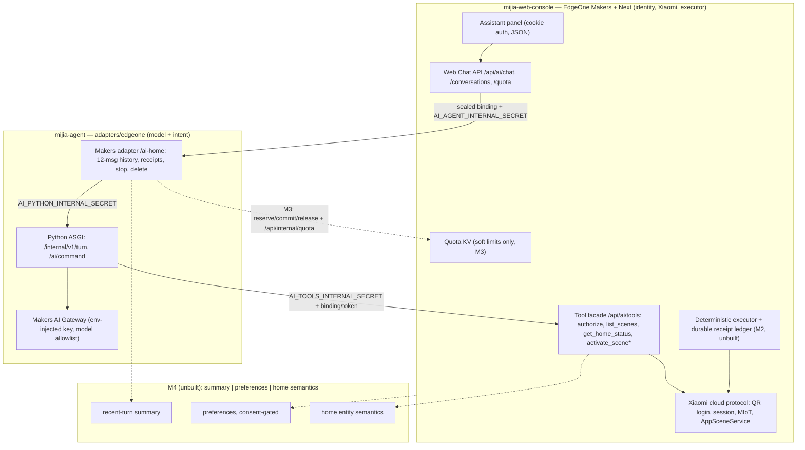

# Steward report alignment

> Historical alignment record. The canonical Phase 1 contract is now the automation-token
> flow in `mijia-general-assistant-design.md` and `contracts.md`; references below to
> `sessionBinding` or `/internal/v1/turn` describe the pre-canonical implementation and
> must not guide new work.

**Inputs:** `mijia-steward-report.html` (云栖管家 architecture decision, 2026.09),
`mijia-agent` @ `origin/main` `e34164d`, `mijia-web-console` @ `origin/main` `6108e33`
plus branch `feat/ai-tools-user-token-path`, and live probes of
`https://agent.fabloki.xyz` (2026-09-21).

**Purpose:** reconcile the report's recommendations with the two-repo reality, keep
one milestone taxonomy (M1–M4), and define the next implementation slices. This
document records verified state; where source survey, repos, or production disagree,
the disagreement is listed as drift, not resolved by assumption.

**Labels:** `implemented` (working and tested) · `partial` (exists but
gated/incomplete) · `missing` (not started) · `intentionally different` (a deliberate
divergence from the report, kept).

## 1. Verdict

The report's core recommendation — borrow the interaction/orchestration shell, but
never put Mijia credentials, device control, or voice into the edge function — is
already realized, in a different shape than it proposed. The shell was not borrowed
from `AI-Chat-Assistant`; it was extracted into a two-repo split: `mijia-web-console`
owns identity, Xiaomi protocol, and the deterministic executor; `mijia-agent` owns
model calls and intent. The report's invariants (no generic tools, credentials never
model-visible, KV never a source of truth, deterministic executor) are all preserved,
several more strictly than proposed.

The remaining 30% the report called "production capability" maps exactly onto the
open milestones: durable executor (M2), quota/cutover (M3), memory (M4), voice
(post-M4). The single most urgent item is not new capability: it is closing the
deployment-evidence drift (§4.2) and the `get_home_status` pipeline drift (§4.1).

## 2. Target architecture

Inviolable boundary: Xiaomi credentials, protocol, real scene IDs, DIDs, and
principal derivation never leave the Console subgraph. The model sees only sanitized
scene aliases, names, descriptions, and structured environment readings; the
executor's status always wins over model text.

## 3. Report → current-state scorecard

| # | Report recommendation | Current state (evidence) | Label |
|---|---|---|---|
| 1 | Borrow chat widget/SSE shell from AI-Chat-Assistant | Console-built panel (`app/components/ai-assistant/`), cookie-auth JSON, no SSE | intentionally different |
| 2 | Single EdgeOne Function for auth+memory+gateway+validation+audit | Split: console Web Chat → Makers adapter → Python, three independently rotated secrets | intentionally different |
| 3 | AI Gateway with own key, no free-tier reliance | `AI_GATEWAY_API_KEY/BASE_URL/MODEL` env-injected in Python, allowlist, no BYOK | implemented |
| 4 | Device gateway wrapping Xiaomi protocol | Console `lib/xiaomi-cloud.ts`, `lib/xiaomi-scenes.ts` (pre-extraction), stays console-side | implemented |
| 5 | Xiaomi route decision gate (OAuth vs unofficial vs HA) | Unofficial cloud API inside console; HA is a preserved future executor adapter | implemented (historic choice) |
| 6 | Semantic bounded tools (`set_power`, `set_room_temperature`, `set_light`, `run_scene`, …) | `list_scenes`, `get_home_status`, `activate_scene` only | intentionally different (scene-level, narrower blast radius) |
| 7 | Ban generic `call_api`/`set_property(did,siid,piid)` | Strict fail-closed validation in Python (`gateway.py`, Pydantic `extra="forbid"`) and console (`remote-tool-service.ts`) | implemented (stronger) |
| 8 | Confirmation tickets for high-risk actions | Scope `scene:activate` + explicit-command check + approved-ID list + hard disable; locks/cameras/gas excluded outright | intentionally different (stricter) |
| 9 | Per-write idempotency + audit record | Envelope `idempotencyKey`, adapter state receipts, LLM JSONL log; no durable cross-conversation receipt | partial (M2) |
| 10 | Post-execution status readback | Not implemented on the agent path | missing (evaluate with M2) |
| 11 | Three-layer memory (summary/preference/home semantics) | Bounded 12-message Makers history only | missing (M4) |
| 12 | EdgeOne KV as memory sidecar | KV reserved for soft quotas; Makers store holds history | intentionally different (report's own KV caveat respected) |
| 13 | Quota, rate limits, budget protection | `AI_QUOTA_ENABLED=false` disabled mode; no cost protection | partial (M3) |
| 14 | Voice phases A/B/C | None | missing (deferred by design) |
| 15 | Live deployment/verification | Makers agent routes live and auth-enforcing; Python surface unverified (§4.2) | partial (drift) |

## 4. Verified drift ledger

### 4.1 `get_home_status` contract drift

The console `/api/ai/tools` accepts `authorize`, `list_scenes`, `get_home_status`,
`activate_scene` on both envelopes (sessionBinding and `X-Ai-User-Token`), with
`activate_scene` hard-disabled (`AI_SCENE_EXECUTION_DISABLED`) and `get_home_status`
returning the sanitized snapshot from `lib/home-environment.ts` (shared with the
dashboard read path). Inside the agent repo the two pipelines disagree: the chat
pipeline (`service.py`/`gateway.py`/`console.py`) implements all three
read/disabled tools, while the `/ai/command` pipeline
(`command_console.py`/`command_service.py`) implements only `list_scenes` and
`activate_scene` — `docs/contracts.md` and `docs/PHASE1-MANUAL-TEST.md` already
describe this split ("read-only status rides `/internal/v1/turn`"). Slice 2 closes
it.

### 4.2 Live deployment inventory (probe evidence, 2026-09-21)

Probed `https://agent.fabloki.xyz` without credentials:

- `POST /ai-home` (with `Makers-Conversation-Id` header) →
  `401 {"code":"AI_UNAUTHENTICATED"}`, `Server: edgeone makers`,
  `Makers-Run-Id` echoed. The Makers agent surface is deployed and enforces auth.
- `POST /ai-home/stop` → `401` same shape; stop route deployed.
  `/ai-home/delete` was not probed.
- `GET /api/healthz` → `404` plain-text "Not Found" with `Functions-Request-Id`
  and `Eo-Pages-Inner-Scf-Status: 404`. The documented Python Cloud Function
  health check fails at this host.
- `GET /api/ai/command` → same 404 shape.
- `GET /healthz` and `GET /ai/command` at the domain root → platform HTML 404
  "The site does not exist" — a different 404 producer than `/api/*`, so root
  paths and `/ai-home` do not share one routing origin (open question).

Conclusion: the console README's production claim is half-true — the Makers agent
is live, the Python Cloud Function and the `/ai/command` ingress are not verifiably
serving. The agent repo's "no live deployment performed" matches the Python surface
but not the Makers surface. Both documents need correction after a proper
inventory. A further exposure: console `origin/main` (#43) retired
`/api/ai/command` to `410 AI_COMMAND_RETIRED` and the README says command traffic
is carried by the agent's `POST /ai/command` — which is not reachable. Whether the
production console runs the #43 build (Siri currently has no live ingress) or a
pre-retirement build (Siri still on the legacy route) is unknown and must be
answered by Slice 1.

### 4.3 Phase-1b user-token path and legacy retirement

Verified: the `X-Ai-User-Token` envelope is **on `origin/main`** (merged via PR
#43, `app/api/ai/tools/route.ts` and `runUserTokenTool` in
`remote-tool-service.ts`) — the "branch-only, unmerged" description is stale. The
generator script also reached main via #43's squash, URL-decode fix included; the
local branch `feat/ai-tools-user-token-path` holds no unique value beyond the
pre-squash history and can be dropped after review. Main's generator already
issues tokens without provider/model/apiKey fields (no-BYOK payload), but
`lib/ai/security/automation-token.ts` still *accepts* those legacy fields
(optionally) — Slice 7 prunes them. The user token never replaces
`AI_TOOLS_INTERNAL_SECRET` (service bearer stays mandatory).

The phase-3 legacy retirement is **also on console main**: `/api/ai/command`
returns the `410 AI_COMMAND_RETIRED` stub pointing Siri at the agent's
`POST /ai/command`. The agent repo's TODO still labels Phase 3 "prepared
locally, gated on dev cutover" — outdated as to the console side. This raises
the stakes on Slice 1: if production runs the main build, Siri shortcuts depend
on an agent ingress that is not verifiably serving (§4.2).

## 5. Security boundary to preserve (non-negotiable invariants)

1. Xiaomi session, `ssecurity`, QR login, principal derivation, real scene IDs,
   DIDs: console only. Python and the adapter receive only opaque bindings/tokens.
2. Model context contains user text, bounded history, locale/timezone, sanitized
   scene summaries; `Result.homeStatus` values stay out of reply text and history.
3. Tool arguments select aliases only; unknown tools/args/aliases fail closed;
   executor status overrides model claims.
4. Deterministic executor stays in the console; the agent never calls Xiaomi
   directly.
5. No generic or per-device raw MIoT tool ever enters the model tool list.
6. EdgeOne KV is never the authoritative executor ledger (eventually consistent,
   no CAS).
7. Internal surfaces (`/internal/v1/turn`, `/api/ai/tools`, agent↔console) are
   secret-authenticated server-to-server only; secrets per boundary, per
   environment, ≥32 chars, never logged.

Every slice below must add or extend a test that fails if any invariant regresses.

## 6. Milestone mapping (report sequence ↔ M1–M4)

| Report step (§08 实施顺序) | Maps to | Status |
|---|---|---|
| 1. 打穿米家控制 (device gateway PoC) | Pre-M1: console device/scene control predates extraction | Done (console); M1 remote integration pending |
| 2. 家居语义层 + idempotency/readback/audit | M1 (alias catalog, approved list) + M2 (durable receipts) | Partial |
| 3. 接入聊天外壳 (AI-Chat-Assistant) | Superseded by the M1 extraction (console Web Chat + Makers adapter + Python) | Done (different shape) |
| 4. 轻量记忆 (three layers) | M4 | Not started |
| 5. 语音 PoC | Post-M4 roadmap | Not started |

The report introduces no competing taxonomy; its five steps map onto M1–M4 with one
deliberate inversion: memory (report step 4) sits behind executor durability (M2)
and quota (M3), because invisible memory without a safe executor is the worse
failure mode. The report's memory hygiene rules (consent, inspect/delete,
write-on-idle, versioned writes) become M4 acceptance criteria verbatim.

## 7. Implementation slices (priority order)

### Slice 1 — Live deployment inventory and drift closure (P0)

- **Owner:** both repos (documentation + deployment, no code).
- **Files/modules:** `docs/m1-deployment-runbook.md` verification sections (fill
  the record), `docs/deployment.md`, console `README.md` /
  `docs/python-agent-extraction.md` (production-address claims).
- **Contract changes:** none.
- **Tests:** none new; the runbook verification table is the test.
- **Deployment gates:** determine which console build production runs (pre- or
  post-#43); deploy the Python Cloud Function from `adapters/edgeone`
  (`npm run build --prefix adapters/edgeone`, then the Makers deploy) or retract
  the claim; record the `AI_AGENT_BASE_URL` actually configured in production.
- **Rollback:** unset `AI_AGENT_BASE_URL` restores the console's same-project
  agent route (existing rule).
- **Acceptance:** `/api/healthz` returns `200 {"status":"ok"}` on the deployed
  host; `/ai/command` reachable from a trusted terminal; the Siri-ingress question
  (§4.2) has a recorded answer; both READMEs state only verified deployment facts;
  runbook sign-off recorded.

### Slice 2 — `get_home_status` parity on the `/ai/command` pipeline (P0)

- **Owner:** `mijia-agent`.
- **Files/modules:** `src/mijia_agent/command_console.py` (add `get_home_status`
  call), `command_service.py` (decision branch, structured result),
  `command_models.py` (additive optional `homeStatus` field on
  `AiCommandResponse`), `command_rules.py` (reuse `chat_tools` /
  `CHAT_TOOLS_ADDENDUM` in the command model request).
- **Contract changes:** additive optional `homeStatus` on the command response;
  internal tool list now matches the documented console contract — docs already
  promise this, implementation catches up.
- **Tests:** `tests/test_command.py` — environment question selects the read-only
  tool; empty/partial completeness; preview rejection; values never in
  `message`/history.
- **Deployment gates:** follows Slice 1's `/ai/command` deployment.
- **Rollback:** feature is additive; revert the branch.
- **Acceptance:** Postman `{ "text": "家里温度多少" }` returns structured readings
  (the `docs/PHASE1-MANUAL-TEST.md` "chat-only today" row flips); measurements
  absent from reply text and stored history in every test.

### Slice 3 — Complete M1 read-only integration (P0.5)

- **Owner:** both repos.
- **Files/modules:** runbook deployment sections; console env `AI_AGENT_BASE_URL`,
  `AI_QUOTA_ENABLED=false`; `adapters/edgeone` deployment.
- **Contract changes:** none (M1 is frozen-contract verification).
- **Tests:** existing `tests/ai-web-chat.test.mjs`, `ai-remote-tools.test.mjs`,
  agent `tests/test_agent.py`, `adapters/edgeone/tests/adapter.test.mjs`.
- **Deployment gates:** runbook exit criteria — A/B principal isolation, stop
  propagation during an in-flight Gateway call (499 `AI_AGENT_CANCELLED`),
  Gateway model verified from the deployed Cloud Function, preview mock,
  disabled-quota summary with no ledger access.
- **Rollback:** unset `AI_AGENT_BASE_URL`; one active backend; never retry an
  uncertain receipt on either backend.
- **Acceptance:** every runbook verification row recorded with evidence; zero
  device actions; no credential/DID/secret in responses or logs.

### Slice 4 — M2 durable executor (P1, blocks all physical activation)

- **Owner:** `mijia-web-console` (executor + receipt store); `mijia-agent`
  consumes unchanged.
- **Files/modules:** new durable receipt store module in the console (name TBD at
  the design gate), the `activate_scene` branch of `/api/ai/tools`, wiring through
  existing `runManualScene` (`lib/xiaomi-scenes.ts`), new env gate (e.g.
  `AI_SCENE_EXECUTION_ENABLED`); tests in `tests/ai-remote-tools.test.mjs` plus a
  new executor test file.
- **Contract changes:** `activate_scene` flips from unconditional
  `AI_SCENE_EXECUTION_DISABLED` to executed-or-uncertain semantics behind the env
  gate; error codes (`AI_EXECUTION_STATUS_UNKNOWN`, `AI_IDEMPOTENCY_CONFLICT`,
  `AI_REQUEST_IN_PROGRESS`) are already mapped on both sides.
- **Design gate (explicit, do not pre-decide):** choose a durable store with
  atomic create/compare-and-set scoped `env + principal + home + idempotency key`,
  independent of conversation. EdgeOne KV is disqualified by the report's and the
  architecture doc's own consistency argument. The receipt must record canonical
  request hash, scene revision, processing/result/uncertain state, timestamps —
  this is the report's per-write audit record; no tokens or credentials in it.
  Evaluate bounded post-execution readback (report recommendation) as part of this
  design, not as a separate commitment.
- **Tests:** duplicate keys across conversations, workers, restarts; scene edited
  after approval; partial results; client disconnect; cancellation/timeout after
  dispatch; settlement failure after execution must not trigger a second action.
- **Deployment gates:** gate env off by default; enable only after the test matrix
  is green and `AI_SCENE_APPROVED_IDS` is reviewed; one real low-risk scene E2E
  last.
- **Rollback:** unset the gate env and redeploy (restores hard disable); never
  blind-retry uncertain receipts — inspect the receipt first (existing rule).
- **Acceptance:** exactly one durable claim per logical command; replays return
  the stored result; uncertain outcomes remain visible with explicit
  reconciliation; no false success; deleting conversation memory never deletes
  receipts.

### Slice 5 — M3 quota, state, and cutover (P1)

- **Owner:** `mijia-agent` (adapter settlement) + `mijia-web-console` (policy
  surface).
- **Files/modules:** `adapters/edgeone/agents/` — reserve before the Python call,
  commit known usage on success/finalized error, conservative estimate on unknown
  transport outcomes, release on pre-flight errors; new authenticated
  `POST /api/internal/quota`; console `lib/ai/web-chat/` quota pass-through and
  `lib/ai/quota/` KV binding.
- **Contract changes:** activate the already-documented M3 contract: every
  successful chat carries a valid quota summary; adapter serves the quota summary
  route.
- **Tests:** adapter settlement-category tests; console quota API tests in enabled
  mode; 429 recovery; A/B isolation; propagation/overrun measurement on real KV.
- **Deployment gates:** `AI_QUOTA_ENABLED=true` only after the deployed adapter
  passes settlement checks; WAF/minute burst limits configured; never a second
  console ledger in remote mode.
- **Rollback:** set `AI_QUOTA_ENABLED=false` (disabled mode has no ledger to
  reset); restore local route only with a verified KV config.
- **Acceptance:** every successful chat carries a valid summary; soft-limit
  overrun measured and documented; bounded receipt retention and conversation TTL
  implemented; unresolved physical outcomes never silently expired.

### Slice 6 — M4 three-layer memory with consent/inspect/delete (P2)

- **Owner:** `mijia-agent` (summary layer, adapter store) + `mijia-web-console`
  (identity, consent and inspect/delete UI, home-semantics projection).
- **Files/modules:** adapter summary roll in `adapters/edgeone/agents/ai-home/`;
  new preference store + console routes (e.g. `/api/ai/memory`) and settings UI;
  home-entity semantics derived from the existing alias catalog
  (`lib/ai/tools/agent-scene-catalog.ts`) and injected as context, never
  hand-configured model-visible data.
- **Contract changes:** new internal memory endpoints and public inspect/delete
  routes; additive `Result` context fields.
- **Storage decision (explicit gate, mirror of M2):** recent-turn summary may live
  where eventual consistency is tolerable (Makers store); preferences and home
  semantics need durability plus reliable delete — the same store criteria as M2,
  not the quota KV.
- **Consent model (from the report, verbatim):** preferences write only on
  explicit user statements or task completion with consent; batched writes with
  version/content-hash dedup; habit evidence yields suggestions, never execution
  authority; household scopes separated.
- **Tests:** delete removes all three layers while receipts survive; no
  token/DID/real scene ID in any memory record; summary bounded and versioned;
  consent-gated writes.
- **Rollback:** memory off via env; deletion routes always available.
- **Acceptance:** a user can view, edit, and delete everything remembered about
  them from the console; conversation beyond 12 messages survives as summary, not
  raw text; zero un-consented preference writes in tests.

### Slice 7 — Automation-token convergence (P2)

- **Owner:** `mijia-web-console`, with the agent repo for ingress parity.
- **Files/modules:** `lib/ai/security/automation-token.ts` (drop the legacy
  optional `provider/model/apiKey` payload fields — main's generator already
  issues session-only tokens); drop the local `feat/ai-tools-user-token-path`
  branch after confirming nothing unique remains; tests
  `ai-automation-token*.test.mjs`.
- **Contract changes:** token payload becomes session + optional bound home only;
  the `/api/ai/tools` user-token path is unchanged otherwise.
- **Decision (deferred to cutover, criteria fixed now):** Siri enters either
  directly via the agent's `POST /ai/command` or via a thin console proxy — decide
  once `/ai/command` is deployed (Slice 1) and quota (Slice 5) is settled; record
  the decision in both contracts docs.
- **Acceptance:** token roundtrip green with session-only payload; main passes
  the full console suite; Siri path documented and live.

### Slice 8 — Voice entry criteria (P3, do not start earlier)

Preconditions, all mandatory: M2 and M3 verified in production, memory consent
shipped (Slice 6), and a measured text-path latency baseline (the report's warning
holds: wake, VAD, ASR first-word, LLM first-token, tool execution, and TTS
first-packet all sit on the critical path). Phase A only — browser-recorded clip →
ASR → existing text agent → TTS — before any streaming/WebSocket/WebRTC gateway,
and before evaluating 小爱音箱/xiaogpt reuse or a local satellite. EdgeOne Functions
host orchestration only, never ASR/TTS inference.

## 8. Non-goals and decisions not to make prematurely

- **No vector database or embeddings now.** The report's MVP answer (three small
  layers) is the plan; revisit only after M4 shows the summary layer failing.
- **No generic raw MIoT tools** (`call_api`, `set_property(did,siid,piid)`) —
  permanent; both repos' fail-closed tests guard it.
- **No per-device control tools** (`set_power`, `set_room_temperature`,
  `set_light`) until scene-level execution is durably safe (M2 done) and a
  confirmation flow is designed; the current state being narrower than the report
  proposed is a feature.
- **No voice before the text path is safe** (Slice 8 preconditions).
- **No EdgeOne KV as the atomic executor ledger** — permanent; also not for
  preferences needing reliable delete.
- **No SSE/streaming chat now.** The JSON contract is frozen through M3; streaming
  is a post-cutover decision with its own latency evidence.
- **No BYOK return; no user model keys.** Model access stays with the
  console-configured Makers Gateway; token provider fields are removed, not
  honored.
- **No second console quota ledger in remote mode; no dual writers for the command
  namespace.**
- **No Home Assistant executor adapter now** (preserved future decision).
- **Do not choose the durable store or the memory store before their design
  gates** (Slices 4 and 6) — candidates are evaluated against the
  atomicity/delete criteria, not picked by default.

## 9. Open questions

1. Does the production console run the main build with the #43 retirement stub —
   and if so, what do Siri shortcuts receive today (a 410 pointing at an
   unreachable agent ingress, or a still-working legacy route)? (Slice 1)
2. Why do `/api/*` and root paths at `agent.fabloki.xyz` produce different 404s —
   stale Cloud Function build, missing build, or misrouted prefix? (Slice 1)
3. Real Makers store atomicity/serialization and delete semantics on the deployed
   runtime (M3 TODO) — the process-local `active` set is explicitly not a
   distributed claim.
4. Makers scheduler API reality for reminders (M4) — verify, do not infer from
   use-case docs.
5. Whether scene-level post-execution readback is meaningful for `activate_scene`
   responses, or only for a future per-device tool family (Slice 4 design gate).
