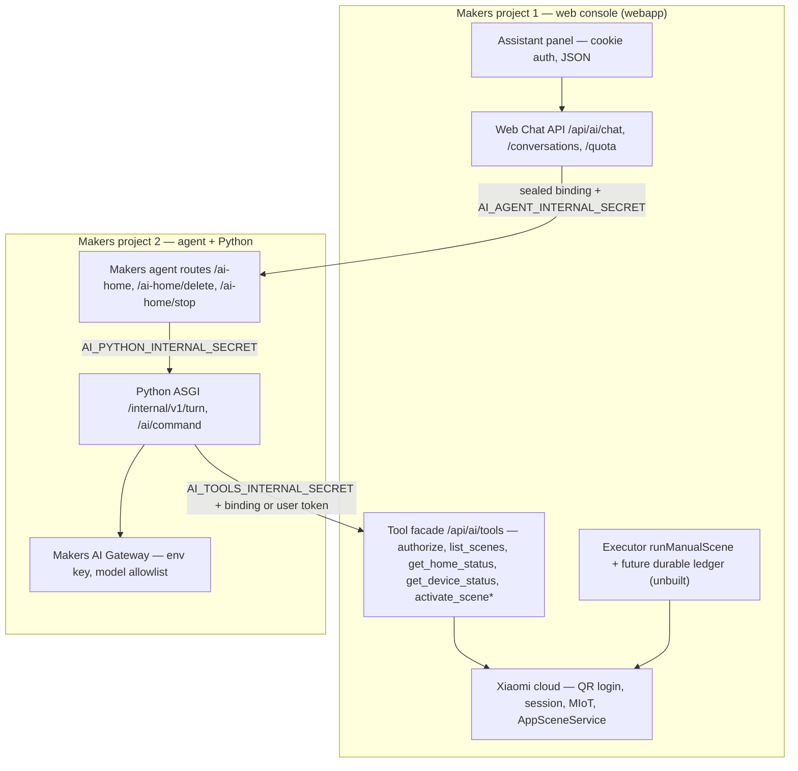

# Steward report alignment

**Inputs:** `mijia-steward-report.html` (云栖管家 architecture decision, 2026.09);
`mijia-agent` @ `origin/main` `b5f5716`; `mijia-web-console` @ `origin/main` `eb67bf1`.

**Method:** every status claim below is read from the code in those two commits, cited
as `path:line`. `docs/TODO.md` is **not** a source — its checklist is historical and
does not describe current behaviour. Deployment topology is out of scope: the system is
two EdgeOne Makers projects (webapp; agent + Python) and no deployment workstream is
proposed here.

**Labels:** `implemented` (working in code today) · `partial` (exists but gated or
incomplete) · `missing` (no code) · `intentionally different` (deliberate divergence
from the report, kept).

## 1. Verdict

The report's core recommendation — borrow the interaction/orchestration shell, but
never put Mijia credentials, device control, or voice in the edge function — is
realized, in a different shape than proposed. Rather than wrapping
`AI-Chat-Assistant`, the shell was split: `mijia-web-console` owns identity, the
Xiaomi protocol, the tool facade, and (future) execution; `mijia-agent` owns model
calls, intent, and the Makers adapter. Every report invariant survives — no generic
tools, credentials never model-visible, KV never a source of truth, a deterministic
executor — several of them more strictly than proposed.

The one deliberate divergence in tool design: the report proposed per-device semantic
tools (`set_power`, `set_room_temperature`, `set_light`, `run_scene`). The code instead
exposes **scene-level and read-only** tools only. That is narrower, not weaker — the
blast radius of a model mistake is one reviewed manual scene rather than an arbitrary
property write — and it should be kept until a durable executor exists.

The remaining gap to the report's target is capability, not architecture: durable
execution, quota settlement, memory, voice. §4 names them with code evidence; §6 turns
them into workstreams.

## 2. Target architecture (two EdgeOne Makers projects)

Inviolable boundary: Xiaomi credentials, protocol, real scene IDs, DIDs and principal
derivation never leave the webapp project. The model sees only user text, bounded
history, locale/timezone, and sanitized scene summaries; structured readings/states are
fetched after tool selection and never enter model messages or conversation history
(`src/mijia_agent/service.py:67-113`).

## 3. Code-truth scorecard

| # | Report target | What the code does today | Label |
|---|---|---|---|
| 1 | Chat/orchestration shell borrowed from AI-Chat-Assistant | Console-built panel (`app/components/ai-assistant/`), cookie-auth JSON; Makers routes forward to Python. No SSE anywhere. | intentionally different |
| 2 | One edge function for auth+memory+gateway+validation+audit | Three hops across two projects with three independently rotated secrets (`adapters/edgeone/agents/ai-home/shared.ts:34-68`). | intentionally different |
| 3 | AI Gateway with own key, no free tier | Python `Settings` requires `AI_GATEWAY_API_KEY`/`BASE_URL`/`MODEL` with an allowlist (`src/mijia_agent/config.py:41-48`); no user keys. | implemented |
| 4 | Device gateway wrapping Xiaomi protocol | Console has list, prop read/write, action, scene run (`app/api/xiaomi/control/route.ts:55-66`, `lib/xiaomi-scenes.ts:308`), 9 s timeouts, no retry loop. | implemented |
| 5 | Xiaomi route decision gate | Unofficial cloud API inside the console; Home Assistant preserved as a future executor adapter (`docs/architecture.md:140`). | implemented (historic) |
| 6 | Semantic bounded tools (`set_power`, `set_room_temperature`, `set_light`, `run_scene`) | `list_scenes`, `get_home_status`, `get_device_status`, `activate_scene` only — no per-device writes (`src/mijia_agent/command_rules.py:190-219`). | intentionally different (scene-level) |
| 7 | Ban generic `call_api` / `set_property(did,siid,piid)` | Strict fail-closed parsing: unknown tools, extra args, invented aliases rejected (`src/mijia_agent/gateway.py:135-178`; console `lib/ai/tools/remote-tool-service.ts`). | implemented (stronger) |
| 8 | Confirmation tickets for high-risk actions | No confirmation UX and no risk tiering: `list_scenes` exposes **every** enabled manual scene (`lib/ai/tools/agent-scene-catalog.ts:46`), and activation is unconditionally disabled rather than risk-gated. | partial |
| 9 | Per-write idempotency + audit record | Adapter receipts in Makers `store.state` (`agents/ai-home/index.ts:3,40,55,63`) and a process-local command store with 10-min TTL (`src/mijia_agent/command_idempotency.py:40-56`); JSONL model log (`src/mijia_agent/llm_log.py`). **No durable cross-conversation claim.** | partial |
| 10 | Post-execution status readback | None — `runManualScene` issues one POST and throws if `result !== true` (`lib/xiaomi-scenes.ts:308-319`); no re-read. | missing |
| 11 | Three-layer memory (summary / preference / home semantics) | Only the latest 12 history messages (`agents/ai-home/index.ts:37-39`). No summary, no preference store. Home semantics exist as a rich domain model but are not exposed as memory. | missing |
| 12 | KV as memory sidecar | KV exists only for soft quotas; Python has no storage access of any kind. | intentionally different |
| 13 | Quota, rate limits, budget protection | Console quota stack present but the remote chat path does no local accounting; the agent implements **zero** quota code and no `/api/internal/quota`. Runs disabled. | partial |
| 14 | Voice phases A/B/C | None. | missing |
| 15 | Preview is read-only | `AI_ENVIRONMENT=preview` returns a fixed mock in both Python pipelines and the console (`src/mijia_agent/service.py:49-50`). | implemented |

## 4. Verified code gaps

Each gap is a delta between code and the report's target, cited to source.

### 4.1 Two pipelines advertise different tools

- **Chat turn** (`service.py`) advertises `list_scenes`, `get_home_status`,
  `get_device_status`, and — only with the `scene:activate` scope and a non-empty
  catalog — `activate_scene` (`command_rules.py:190-219`).
- **Command ingress** (`/ai/command`) advertises exactly one model tool:
  `activate_scene` (`command_service.py:255`). It *preloads* scenes through a console
  `list_scenes` call (`command_service.py:105`) but never exposes `list_scenes`,
  `get_home_status`, or `get_device_status` to the model, and `CommandResponse` has no
  `homeStatus`/`deviceStatus` fields (`command_models.py:68-82`).

Consequence: a Siri/Postman caller cannot ask "which lights are on" or "what's the
temperature" — the read-only tools the report calls for simply are not on that surface.
Workstream A.

### 4.2 No execution path exists

`activate_scene` is unconditionally rejected before any device call
(`lib/ai/tools/remote-tool-service.ts:97,197`, `AI_SCENE_EXECUTION_DISABLED`, 403). No
receipt, ledger, execution-store, or idempotency-store module exists in the console —
the extraction deleted the old embedded executor. The only working scene runner,
`runManualScene`, does a single POST with **no retry, no idempotency key, and no
post-write readback** (`lib/xiaomi-scenes.ts:308-319`). Both the report (§"每次写操作
都要有 request_id 幂等键…回读结果") and `docs/architecture.md` require a durable
principal/home/idempotency-key receipt before any physical action. Workstream C.

### 4.3 Scene exposure has no risk tiering

`list_scenes` returns every enabled manual scene in the home as an alias
(`lib/ai/tools/agent-scene-catalog.ts:46`). There is **no** `AI_SCENE_APPROVED_IDS`
gate in the console code — that environment variable exists only in this repo's
historical docs and must not be described as live. The report asks for a reviewed,
risk-tiered exposure list and confirmation for risky actions; today the only barrier is
that execution is switched off entirely. Workstreams A and D.

### 4.4 Command-pipeline error codes collapse

`ConsoleAgentTools` accepts eleven console codes including `AI_HOME_FORBIDDEN` (403),
`XIAOMI_SCENE_DISABLED` (400), `AI_IDEMPOTENCY_CONFLICT` (409) and
`AI_REQUEST_IN_PROGRESS` (409) (`command_console.py:17-32`), but `COMMAND_ERROR_MAP`
has no entry for any of them, so all four degrade to `MI_CLOUD_ERROR` 502
(`app.py:24-40`). A caller cannot distinguish "you don't own this home" from "the cloud
is down". Workstream B.

### 4.5 Idempotency is not durable anywhere

The command store is a process-local dict (`command_idempotency.py:40-56`): state is
lost on restart and not shared across workers. Adapter receipts live in the Makers
conversation store with no TTL and no atomic compare-and-set guarantee
(`agents/ai-home/index.ts:3`). Neither is the durable, conversation-independent claim
the report requires. Workstream C.

### 4.6 No memory beyond raw history

The adapter keeps the last 12 messages verbatim (`agents/ai-home/index.ts:37-39`); no
summarisation, no preference extraction, no consent or inspect/delete surface. The
report's three-layer memory (recent summary / user preferences / home semantics) is
unbuilt. Home semantics do exist as a domain model (`lib/device-management.ts`,
`lib/device-topology.ts`) and could feed the third layer without new data. Workstream F.

### 4.7 Quota settlement is unbuilt on the agent side

The console ships a full quota stack (`lib/ai/quota/*`) but the remote chat path does no
local accounting; when `AI_QUOTA_ENABLED=false` it synthesises a `disabled` summary
(`lib/ai/web-chat/web-chat-service.ts:242,257-259`). The agent has no reserve/commit/release
and no quota summary route, so enabling quota today would fail closed with 502. The
report's "预算/限流" requirement is unmet. Workstream E.

### 4.8 Token payload still types BYOK fields

`AutomationTokenPayload` still declares optional `provider`/`model`/`apiKey`
(`lib/ai/security/automation-token.ts:11-13`). Issuance rejects them
(`app/api/ai/automation-token/route.ts:68`) and readers ignore them, so this is dead
surface rather than a live BYOK path — but it contradicts the "no user model keys"
invariant and should be removed. Workstream G.

## 5. Invariants to preserve

1. Xiaomi session, `ssecurity`, QR login, principal derivation, real scene IDs, DIDs —
   webapp only. Python and the adapter receive opaque bindings/tokens only
   (`command_console.py:1-8`).
2. Structured readings/device states never enter model messages, replies, or history
   (`service.py:73-74,99-101`).
3. Tool arguments select aliases only; unknown tools/args/aliases fail closed; executor
   status overrides model text (`gateway.py:135-178`).
4. The deterministic executor stays in the webapp; the agent never calls Xiaomi.
5. No generic or per-device raw MIoT tool enters the model tool list.
6. EdgeOne KV is never an authoritative ledger (eventually consistent, no CAS).
7. Internal surfaces are secret-authenticated server-to-server only; secrets per
   boundary and environment, ≥32 chars, never logged (`config.py:34-40`).

Each workstream must add or extend a test that fails if its invariant regresses.

## 6. Workstreams

Ordered by correctness risk before feature growth. Each states current code → target
delta → files → tests → acceptance.

### Workstream A — Tool-surface parity and scene exposure policy

- **Current:** command ingress advertises only `activate_scene`; `list_scenes` exposes
  all enabled scenes with no tiering (§4.1, §4.3).
- **Target delta:** decide and implement the read-only tool set for `/ai/command`
  (reuse `chat_tools()` from `command_rules.py` so both pipelines share one definition),
  add `homeStatus`/`deviceStatus` to `CommandResponse`, and decide whether `list_scenes`
  keeps exposing every enabled scene or gains a reviewed/risk-tiered list.
- **Files:** `src/mijia_agent/command_service.py`, `command_models.py`,
  `command_rules.py`, `command_console.py`; console
  `lib/ai/tools/agent-scene-catalog.ts`.
- **Tests:** `tests/test_command.py` — an environment/device question selects the
  read-only tool; values stay out of `message` and history; a disabled or unreadable
  device reports `unknown`, never a guess.
- **Acceptance:** both pipelines advertise the same read-only tools; `{ "text": "家里温度多少" }`
  returns structured readings; the exposure policy is written down and enforced by a test.

### Workstream B — Command-pipeline error fidelity

- **Current:** four console codes collapse to `MI_CLOUD_ERROR` 502 (§4.4).
- **Target delta:** add stable entries to `COMMAND_ERROR_MAP` (e.g.
  `AI_HOME_FORBIDDEN` 403, `XIAOMI_SCENE_DISABLED` 400, and the two 409s) so callers can
  distinguish authorisation from infrastructure failure.
- **Files:** `src/mijia_agent/app.py:24-40`.
- **Tests:** `tests/test_command.py` — each console code surfaces as its own public code.
- **Acceptance:** no console error degrades to a generic 502 except genuinely unknown ones.

### Workstream C — Durable execution ledger (blocks all activation)

- **Current:** activation hard-disabled; `runManualScene` has no retry, idempotency, or
  readback; no durable store on either side (§4.2, §4.5).
- **Target delta:** a durable store with atomic create/compare-and-set keyed
  `env + principal + home + idempotencyKey`, independent of conversation, holding the
  canonical request hash, scene revision, state (`processing`/`result`/`uncertain`) and
  timestamps; wire `runManualScene` behind an off-by-default env gate; add bounded
  post-execution readback; never retry an `uncertain` outcome blindly. EdgeOne KV is
  disqualified (eventual consistency, no CAS).
- **Files:** new console store module, `lib/ai/tools/remote-tool-service.ts`,
  `lib/xiaomi-scenes.ts`, `app/api/ai/tools/route.ts`.
- **Tests:** duplicate keys across conversations/workers/restarts; scene edited after
  approval; partial result; client disconnect; timeout after dispatch; settlement
  failure cannot trigger a second action.
- **Acceptance:** exactly one durable claim per logical command; replays return the
  stored result; `uncertain` stays visible with explicit reconciliation; deleting
  conversation memory never deletes receipts.

### Workstream D — Risky-action confirmation UX

- **Current:** no confirmation surface; the panel always sends an idempotency key, which
  is what grants `scene:activate` scope (`lib/ai/web-chat/web-chat-service.ts:230-232`).
- **Target delta:** a parameters-bound, short-expiry confirmation step for the high-risk
  categories the report names (locks, cameras, gas/heating, bulk power-off, actions
  while nobody is home), shown before an activation is dispatched.
- **Files:** `app/components/ai-assistant/*`, a confirmation token module, the console
  tool facade.
- **Tests:** confirmation binds to the exact params and action; expiry is enforced;
  a mismatched or expired confirmation cannot execute.
- **Acceptance:** no high-risk activation dispatches without a matching live confirmation;
  low-risk scenes stay one-step.

### Workstream E — Quota settlement end to end

- **Current:** console quota stack idle; agent has no quota code (§4.7).
- **Target delta:** adapter-owned reserve/commit/release with known-usage,
  unknown-outcome, and pre-flight categories; a principal-bound summary on every success;
  an authenticated `POST /api/internal/quota` summary route; then flip
  `AI_QUOTA_ENABLED=true` (never run a second console ledger in remote mode).
- **Files:** `adapters/edgeone/agents/*`; console `lib/ai/web-chat/*`, `lib/ai/quota/*`.
- **Tests:** settlement categories; 429 recovery; A/B isolation; propagation/overrun on
  real KV, retaining `softLimit: true`.
- **Acceptance:** every successful chat carries a valid summary; overrun is measured and
  documented; production stays fail-closed when the store is unavailable.

### Workstream F — Three-layer memory with consent

- **Current:** 12-message history only (§4.6).
- **Target delta:** recent-turn summary (bounded, versioned), consent-gated preferences
  with inspect/edit/delete, and home semantics projected from the existing device model.
  Preferences need durability plus reliable delete — the same store criteria as
  Workstream C, not the quota KV.
- **Files:** `adapters/edgeone/agents/ai-home/*`; console memory routes + settings UI;
  `lib/device-management.ts` as the semantics source.
- **Tests:** delete clears all three layers while receipts survive; no token/DID/real
  scene ID in any record; summary is bounded and versioned; no un-consented writes.
- **Acceptance:** a user can view, edit, and delete everything remembered about them;
  conversation beyond 12 messages survives as a summary, not raw text.

### Workstream G — Token payload hygiene

- **Current:** `AutomationTokenPayload` still types optional BYOK fields (§4.8).
- **Target delta:** drop `provider`/`model`/`apiKey` from the type once no consumer reads
  them; keep the token a session + optional-bound-home credential.
- **Files:** `lib/ai/security/automation-token.ts`, `scripts/generate-automation-token.ts`,
  token tests.
- **Acceptance:** token round-trip passes with a session-only payload; no BYOK field is
  accepted or emitted anywhere.

### Workstream H — Voice entry criteria

Preconditions, all mandatory before any voice work: Workstreams C and E shipped and
verified, Workstream F consent shipped, and a measured text-path latency baseline (the
report's warning holds: wake, VAD, ASR first-word, LLM first-token, tool execution, and
TTS first-packet all sit on the critical path). Then Phase A only — browser-recorded clip
→ ASR → the existing text agent → TTS — before any streaming/WebSocket/WebRTC gateway or
satellite. EdgeOne functions host orchestration only, never ASR/TTS inference.

## 7. Non-goals

- **No vector database or embeddings now.** The report's MVP answer (three small layers)
  is the plan; revisit only if the summary layer demonstrably fails.
- **No generic raw MIoT tools** (`call_api`, `set_property(did,siid,piid)`) — permanent.
- **No per-device control tools** (`set_power`, `set_room_temperature`, `set_light`) until
  Workstream C is done; the current scene-level surface is a feature, not a gap.
- **No voice before the text path is safe** (Workstream H preconditions).
- **No EdgeOne KV as the executor ledger or the preference store.**
- **No SSE/streaming chat now** — the JSON contract holds until execution and quota are
  settled.
- **No BYOK return; no user model keys.**
- **No second console quota ledger in remote mode; no dual writers for the command namespace.**
- **No Home Assistant executor adapter yet.**

## 8. Open questions

1. Does the Makers conversation store give atomic create/compare-and-set, or must the
   execution ledger live elsewhere? (Workstream C design.)
2. Is scene-level post-execution readback meaningful, or only useful once per-device
   tools exist? (Workstream C.)
3. Should `/ai/command` adopt the full read-only tool set, or stay action-only by design
   as the Siri ingress? (Workstream A.)
4. Which scene categories count as high-risk enough to require confirmation, given the
   console has no risk metadata today? (Workstream D.)
